# Laporan Praktikum Sistem Operasi Jobsheet 10

<h4>Nama : Faisal Rizky <h4>
<h4>NIM : 254107020224 <h4>
<h4>Kelas : TI-1H <h4>

## Praktikum 10.1  Melihat Penggunaan Memori
1. Jalankan free -h untuk melihat ringkasan RAM dan swap
```
free -h
```
Hasil :


2. Lihat detail memori dari kernel melalui /proc/meminfo
```
cat / proc / meminfo | head -n 20
```
Hasil :


### Studi Kasus 10.1 Server Lambat karena Memori
1. Periksa kondisi memori secara keseluruhan
```
free -h
```
Hasil :


2. Pantau proses secara real-time
``` 
top
```
Hasil :


## Praktikum 10.2 Mengamati Aktivitas Paging
1.  Jalankan vmstat dengan interval 1 detik, 5 sampel
```
vmstat 1 5
```
Hasil :


## Praktikum 10.3 Membuat dan Mengonfigurasi Swap File
1. Buat file berukuran 512 MB sebagai calon swap
```
sudo fallocate -l 512 M / swapfile - week10
```
Hasil :
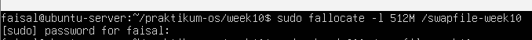


2. Atur permission file menjadi 600 — hanya root yang boleh membaca dan menulis
```
sudo chmod 600 / swapfile - week10
```
Hasil :
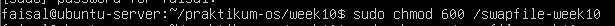

3. Format file sebagai area swap, lalu aktifkan
```
sudo mkswap / swapfile - week10
sudo swapon / swapfile - week10
```
Hasil :
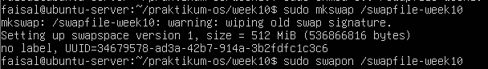

4. Verifikasi swap aktif. Anda akan melihat entri /swapfile-week10 dengan ukuran 512M, dan nilai total pada baris Swap di free -h bertambah 512M
```
swapon -- show
free -h
```
Hasil :
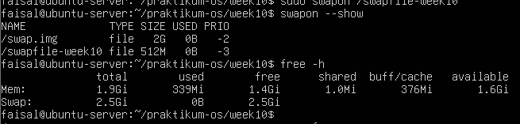

5. Periksa nilai swappiness, ubah sementara, dan verifikasi perubahan
```
cat / proc / sys / vm / swappiness
sudo sysctl vm . swappiness =10
cat / proc / sys / vm / swappiness
```
Hasil :
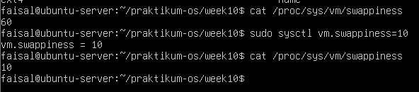


Analisis:
1. Berapa nilai swappiness default? Apa artinya bagi perilaku kernel dalam menggunakan swap?
2. Setelah diubah ke 10, konfirmasi nilai berubah pada output cat kedua. Apa dampak nilai 10 terhadap penggunaan swap dibanding nilai 60?
3. Apakah entri /swapfile-week10 muncul di swapon –show? Jika tidak, pastikan Langkah 2 (chmod 600) sudah dijalankan sebelum Langkah 3

Jawaban :

1. Nilai defaultnya 60, yang berarti bahwa kernel tidak membuang semua page canche, tetapi tidak juga menaruh aplikasi ke swap secara agresif
2. Aplikasi yang sedang dijalankan menjadi lebih responsif, terutama saat berpindah-pindah aplikasi atau multitasking
3. entri /swapfile-week10 muncul di swapon --show dan hasilnya ada di gambar di langkah 4


## Praktikum 10.4 Monitoring Memory
1. Ambil snapshot proses diurutkan dari penggunaan memori terbesar
```
ps aux -- sort = -% mem | head
```
Hasil :
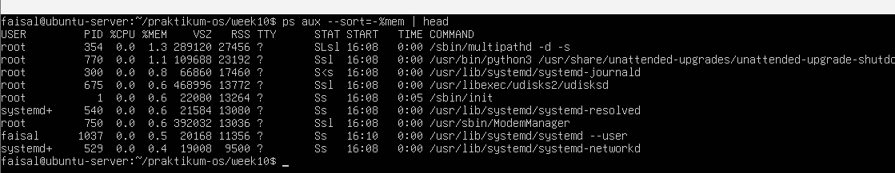

2. Pantau secara real-time dengan top
```
top
```
Hasil :
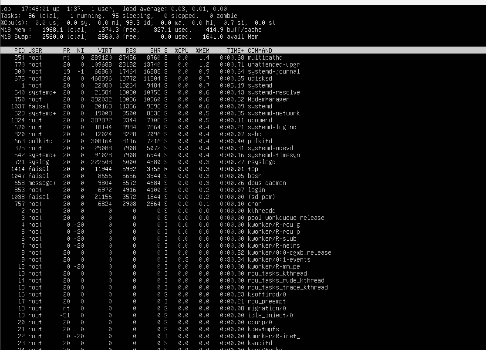


## Praktikum 10.5 Script Monitor Memori
1. Masuk ke direktori kerja dan buat file script:
```
cd ~/ praktikum - os / week10 - memory
nano monitor - memori . sh
```
Hasil :
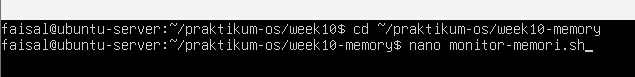

2. Ketik script berikut:
```
#!/ bin / bash
set - euo pipefail
THRESHOLD =20
echo "=== Monitor Memori ==="
date
echo
free -h
echo
AVAIL = $ ( free | awk '/ Mem / { printf "% d " , $7 / $2 *100} ')
if [ " $AVAIL " - lt " $THRESHOLD " ]; then
echo " PERINGATAN : Memori tersedia hanya $ { AVAIL }%!"
else
echo " Status : Memori tersedia $ { AVAIL }% ( normal ) "
fi
echo
echo " - - - 5 Proses Memori Tertinggi - - -"
ps aux -- sort = -% mem | head -n 6 | tail -n 5
```
Hasil :
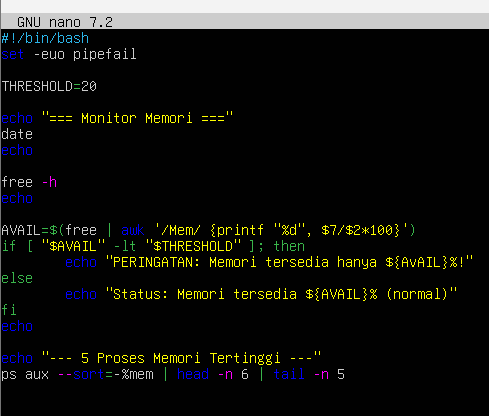

3. izinkan dan jalankan
```
chmod + x monitor - memori . sh
bash monitor - memori . sh
```
Hasil :
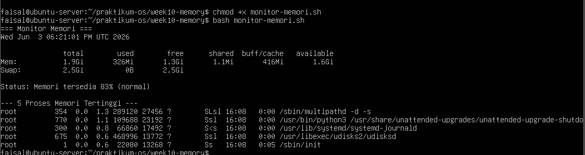


### Studi Kasus 10.2 Gagal Akses File
1. Buat direktori dan file konfigurasi contoh
```
mkdir -p ~/ praktikum - os / week10 - memory / syscall - case
cd ~/ praktikum - os / week10 - memory / syscall - case
echo " PORT =8080" > app . conf
ls -l app . conf
cat app . conf
```
Hasil :


2. Simulasikan permission bermasalah
```
chmod 000 app . conf
cat app . conf
```
Hasil :


3. Kembalikan permission dan verifikasi
```
chmod 644 app . conf
cat app . conf
```
Hasil :


Analisis:
1. Mengapa cat menghasilkan Permission denied setelah chmod 000? System call apa yang gagal?
2. Apa perbedaan pesan error Permission denied vs No such file or directory? Coba rm app.conf lalu cat app.conf untuk melihat perbedaannya
3. Permission 644 berarti apa untuk owner, group, dan others?

Jawaban : 

1. karena chmod 000 mengartikan bahwa file sudah berubah menjadi terlarang atau yang lain tidak memiliki hak akses dan System call yang gagal adalah openat()
2. Permission denied: File benar-benar ada secara fisik di dalam folder, tetapi tidak dapat diakses karena tidak memiliki hak aksesnya. sedangkan 
No such file or directory : file benar" tidak ada
3. Angka 644 membagi izin untuk tiga pihak: digit pertama (6) untuk pemilik file (Owner), digit kedua (4) untuk grup (Group), dan digit ketiga (4) untuk orang lain (Others)


## Praktikum 10.6 Mengamati System Call dengan strace
1. Lihat 30 baris pertama system call dari perintah ls
```
strace ls 2 >&1 | head -n 30
```
Hasil :
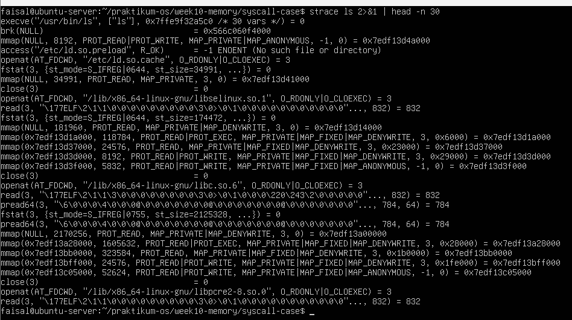

2. Lihat ringkasan statistik dan bandingkan dua direktori berbeda
```
strace -c ls
strace -c ls / etc 2 >&1 | tail -5
```
Hasil :
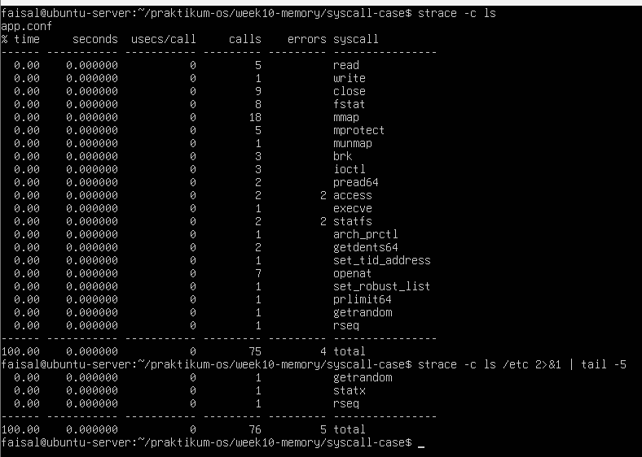


## TUGAS PRAKTIKUM 
Kerjakan seluruh tugas pada direktori berikut :
```
mkdir -p ~/ praktikum - os / week10 - memory
cd ~/ praktikum - os / week10 - memory
```

### Tugas 10.1 Audit Penggunaan Memori Sistem
Buat script memory-audit.sh yang menghasilkan laporan kondisi memori sistem secara otomatis
```
nano ~/ praktikum - os / week10 - memory / memory - audit . sh
```

```
#!/ bin / bash
set - euo pipefail
LAPORAN =" memory - report . txt "
{
echo "=== LAPORAN MEMORI SISTEM ==="
date
echo
echo " - - - Ringkasan free -h - - -"
free -h
echo
echo " - - - / proc / meminfo - - -"
cat / proc / meminfo | head -n 20
} > " $LAPORAN "
echo " Laporan disimpan ke : $LAPORAN "
cat " $LAPORAN "
```

```
chmod + x ~/ praktikum - os / week10 - memory / memory - audit . sh
cd ~/ praktikum - os / week10 - memory
bash memory - audit . sh
```
Hasil :

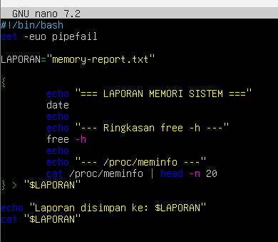
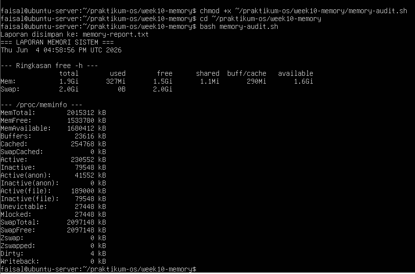 

Analisis
1. Hitung persentase memori tersedia (available / total × 100%). Apakah sistem dalam kondisi normal?
2. Mengapa buff/cache tidak dihitung sebagai memori yang terpakai dari sudut pandang ketersediaan untuk aplikasi?
3. Dari /proc/meminfo, apakah SwapTotal lebih besar dari 0? Berapa nilai SwapFree?

jawaban :

1. Hasil hitungan persentase 83.38% dan itu artinya masih normal
2. ini merupakan "Free RAM is wasted RAM" yang berarti Daripada membiarkan RAM kosong melompong, sistem operasi meminjamnya untuk menyimpan Cache dan mengakibatkan proses membuka file dengan cepat saat akan membuka file
3. Swaptotal lebih besar dari 0 dan nilai swapfree sama dengan swaptotal yaitu 2097148kb


### Tugas 10.2 Identifikasi Proses dengan Memori Tertinggi
Simpan daftar 10 proses pengguna memori terbesar ke file
```
ps aux -- sort = -% mem | head -n 10 > top - memory - process . txt
cat top - memory - process . txt
```
Hasil :
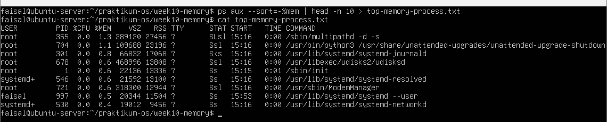

Analisis
1. Proses apa di urutan pertama? Catat nilai %MEM dan RSS.
2. Konversikan RSS ke MB (bagi 1024). Apakah wajar?
3. Jumlahkan %MEM dari 5 proses teratas. Berapa persen RAM yang mereka gunakan bersama?

Jawaban :

1. yang terjadi di urutan pertama yaitu proses /sbin/multipathd -d -s dengan %MEM (1.3) dan RSS (27456)
2. 27456 dibagi 1024 = 26,8 MB. dan proses ini wajar dan menandakan Proses terberat di komputermu saat ini hanya memakan memori sekitar 26,8 MB
3. RAM hanya menggunakan 4,4% 


### Tugas 10.3 Membuat dan Memverifikasi Swap File
Buat swap file khusus tugas sebesar 256 MB dan verifikasi
```
sudo fallocate -l 256 M / swapfile - tugas - week10
sudo chmod 600 / swapfile - tugas - week10
sudo mkswap / swapfile - tugas - week10
sudo swapon / swapfile - tugas - week10
```

```
{
echo "=== VERIFIKASI SWAP ==="
swapon -- show
echo
free -h
} > swap - check . txt
cat swap - check . txt
```
Hasil :
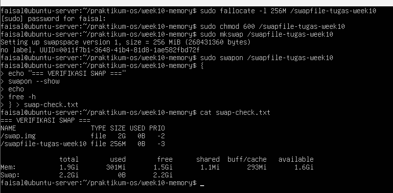


Analisis
1. Identifikasi kolom NAME, TYPE, SIZE, dan USED pada output swapon –show.
2. Apakah nilai total pada baris Swap di free -h bertambah 256 MB?
3. Mengapa permission 600 penting? Apa risiko jika diatur ke 644?

Jawaban :

1. ada dua macam NAME, TYPE, SIZE, dan USED pada output swapon –show, yaitu yang pertama bawaan sistem dengan nama /swap.img dan yang kedua buatan sendiri dengan nama /swapfile-tugas-week10
2. Ya, Nilai total Swap bertambah menjadi 2.2Gi
3. Angka 600 memastikan bahwa hanya super-user (root) yang bisa membaca (read) dan menulis (write) ke dalam file swap tersebut. User lain tidak memiliki akses sama sekali


### Tugas 10.4 Analisis System Call dengan strace
Analisis system call yang dipanggil perintah ls
```
strace -c ls 2 > strace - summary . txt
strace ls / etc 2 > strace - ls - etc . txt
cat strace - summary . txt
```
Hasil :
 


Analisis
1. Sebutkan minimal 5 system call dari strace-summary.txt beserta fungsi singkatnya
2. System call mana yang paling sering dipanggil? Mengapa?
3. Apakah ada errors lebih dari 0? Apakah program tetap berjalan normal meskipun ada kegagalan tersebut?

Jawaban :

1. mmap: Memetakan (mapping) sebuah file atau pustaka (library) langsung ke dalam memori RAM agar bisa dieksekusi lebih cepat.
openat: Membuka sebuah file atau direktori (folder).
read: Membaca isi data dari sebuah file yang sudah dibuka.
write: Menulis data. Dalam kasus perintah ls, system call ini digunakan untuk "menulis" teks hasil daftar direktori ke layar terminalmu.
close: Menutup jalur komunikasi dengan file yang sudah selesai dibaca atau ditulis, agar sistem tidak membuang-buang memori
2. system call yang paling sering dipanggil adalah mmap. karena ls membutuhkan banyak pustaka bantuan (shared libraries seperti .so files) untuk berjalan, misal pustaka untuk membaca konfigurasi terminal, membaca format teks, dan keamanan sistem. Setiap kali program ls baru dijalankan, sistem operasi harus memuat (load) semua pustaka tersebut ke dalam RAM menggunakan system call mmap
3. ada 4 error secara total (2 pada access dan 2 pada statfs). tetapi program tetap berjalan normal meskipun ada error


### Tugas 10.5 Studi Kasus Diagnosa Server Lambat
```
nano ~/ praktikum - os / week10 - memory / diagnosa - server . sh
```
```
#!/ bin/ bash
set - euo pipefail

LAPORAN =" diagnosa -server - lambat .txt"
WARN_MEM = false
WARN_SWAP =0
cek_memori () {
echo " --- Kondisi Memori ---"
free -h
echo
AVAIL_PCT = $ ( free | awk '/Mem/ { printf "%d" , $7/$2 *100}
')
if [ " $AVAIL_PCT " - lt 20 ]; then
echo " PERINGATAN : Memori tersedia hanya ${
AVAIL_PCT }%"
WARN_MEM = true
fi
}
cek_swap () {
echo " --- Penggunaan Swap ---"
swapon -- show 2 >/ dev / null || echo " Tidak ada swap
aktif "
echo
WARN_SWAP = $ ( free | awk '/ Swap / { print $3}')
if [ " $WARN_SWAP " - gt 0 ]; then
echo " INFO : Swap digunakan (${ WARN_SWAP } kB)"
fi
}
cek_proses () {
echo " --- 10 Proses Memori Tertinggi ---"
ps aux -- sort = -% mem | head -n 11
echo
}
cek_paging () {
echo " --- Aktivitas Paging (5 sampel ) ---"
vmstat 1 5
echo
}
ringkasan () {
    echo "=== RINGKASAN ==="
if [ " $WARN_MEM " = true ]; then
echo "- Memori : KRITIS - perlu tindakan segera "
else
echo "- Memori : normal "
fi
if [ " $WARN_SWAP " - gt 0 ]; then
echo "- Swap : aktif - pantau aktivitas paging "
else
echo "- Swap : tidak digunakan "
fi
}
{
echo "=== LAPORAN DIAGNOSA SERVER ==="
date
echo
cek_memori
cek_swap
cek_proses
cek_paging
ringkasan
} | tee " $LAPORAN "
echo
echo " Laporan disimpan ke: $LAPORAN "
```

```
chmod + x ~/ praktikum - os / week10 - memory / diagnosa - server . sh
cd ~/ praktikum - os / week10 - memory
bash diagnosa - server . sh
```
Hasil :


Analisis
1. Jelaskan peran masing-masing fungsi: cek_memori, cek_swap, cek_proses, cek_paging, dan ringkasan. Mengapa diagnosa dipecah menjadi fungsi terpisah?
2. Berdasarkan bagian RINGKASAN, apakah kondisi sistem normal atau kritis? Jelaskan berdasarkan nilai threshold yang digunakan script
3. Mengapa script menggunakan tee "$LAPORAN" bukan redirection biasa > "$LAPORAN"? Apa keuntungannya?
4. Dari output cek_paging, apakah ada aktivitas si atau so? Jika ada, apa implikasinya terhadap performa server?

Jawaban :

1. cek_memori: Mengambil persentase RAM yang tersedia (AVAIL_PCT). Jika memori yang tersisa di bawah 20%, akan mengubah saklar WARN_MEM menjadi true.
cek_swap: Memeriksa apakah memori Swap aktif dan mencatat berapa kilobyte yang sedang terpakai ke dalam variabel WARN_SWAP.
cek_proses: Mengurutkan 10 program yang paling banyak memakan RAM saat itu.
cek_paging: Menggunakan perintah vmstat untuk merekam sampel aktivitas pergerakan memori tingkat rendah selama 5 detik terakhir.
ringkasan: Mengambil keputusan akhir. Ia melihat nilai WARN_MEM dan WARN_SWAP, lalu mencetak kesimpulan apakah server sedang kritis atau aman.
Dipecah menjadi fungsi yang terpisah karena itu merupakan prinsip dari clean code
2. Sistem berada dalam kondisi normal. 
Penjelasan Threshold: Pada fungsi cek_memori, script menetapkan batas bawah (threshold) di angka 20%. Artinya, peringatan kritis hanya akan menyala jika RAM yang tersisa kurang dari 20%. Karena komputermu saat ini memiliki RAM kosong (Available) sekitar 1.6Gi (lebih dari 80%), maka kondisi terpenuhi sebagai "normal"
3. Redirection (>): Jika menggunakan >, aliran data akan langsung dibelokkan ke dalam file diagnosa-server-lambat.txt. Layar terminal akan gelap/kosong, dan tidak bisa melihat laporannya secara live, dan harus membuka file tersebut secara terpisah menggunakan cat.
sedangkan 
Perintah tee: Mengambil inspirasi dari bentuk pipa huruf "T". Perintah ini membelah aliran data menjadi dua arah. Satu arah menampilkannya secara langsung di layar monitor, sementara arah yang satu lagi diam-diam menyimpannya ke dalam file dan memiliki keuntungan bisa memantau server secara real-time sekaligus mendapatkan backup laporannya.
4. Aktivitas: Semua nilainya adalah 0. Tidak ada aktivitas paging sama sekali di kelima sampel waktu. yang berarti RAM fisik masih sangat sanggup menangani seluruh aplikasi.