# Laporan Praktikum Sistem Operasi Jobsheet 11

<h4>Nama : Faisal Rizky <h4>
<h4>NIM : 254107020224 <h4>
<h4>Kelas : TI-1H <h4>

## Praktikum 11.1 — Permissions
1. Buat direktori kerja dan dua file uji
```
mkdir ~/ lab - permissions && cd ~/ lab - permissions
echo " data rahasia " > secret . txt
echo '#!/ bin/ bash ' > myscript . sh
echo 'echo Hello ' >> myscript . sh
ls - la
```
Hasil :
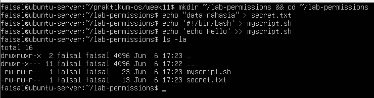

2. Jadikan secret.txt privat hanya untuk owner
```
chmod 600 secret . txt
ls -l secret . txt
```
Hasil :

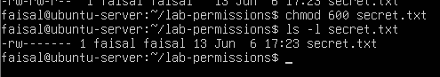

3. Jadikan myscript.sh dapat dijalankan
```
chmod 755 myscript . sh
ls -l myscript . sh
./ myscript . sh
```
Hasil :

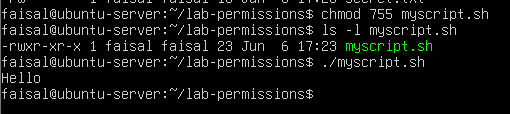

4. Buat direktori bersama dan amati efek SGID sederhana
```
mkdir shared - dir
chmod g + s shared - dir
ls - ld shared - dir
```
Hasil :

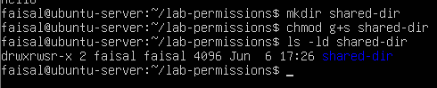

5. Uji efek umask pada file baru
```
umask
umask 027
touch testfile -027
ls -l testfile -027
```
Hasil :

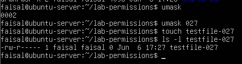

Analisis
1. Mengapa secret.txt tidak dapat dibaca oleh group dan others setelah chmod 600?
2. Apa perbedaan arti 600 dan 755 terhadap file yang diuji?
3. Setelah umask 027, permission apa yang dihasilkan untuk file baru, dan mengapa bukan 777?

Jawaban :

1. Karena angka 600 adalah angka kombinasi dari:
 digit 1 (6) untuk user, berasal dari 4 (Read) + 2 (Write) = 6. Jadi pemilik file memiliki izin rw-
 digit 2 (0) untuk group, yang berarti tidak memiliki izin sama sekali
 digit 3 (0) untuk others, yang berrati juga sama dengan group tidak memiliki izin sama sekali
2. jika 600 hanya untuk user. user bisa baca/tulis, yang lain tidak bisa. sedangkan 755 artinya
User: 7  berasal dari 4+2+1 yang artinya (rwx - Baca, Tulis, Eksekusi)
Group: 5 berasal dari 4+0+1 yang artinya (r-x - Baca, Eksekusi)
Others: 5 berasal dari 4+0+1 yang artinya (r-x - Baca, Eksekusi)
3. permission yang dihasilkan untuk testfile-027 adalah -rw-r-----
umask berfungsi sebagai pengurang (filter) dari izin dasar (base permission) dan 777 Izin dasar untuk Direktori baru dan linux tidak pernah memberikan izin eksekusi (x) secara otomatis pada file teks yang baru dibuat menggunakan perintah seperti touch atau echo


## Praktikum 11.2 — ACL
1. Siapkan file dan lihat permission standar tanpa ACL tambahan
```
mkdir ~/ lab - acl && cd ~/ lab - acl
echo " Data penting " > confidential . txt
chmod 640 confidential . txt
ls -l confidential . txt
getfacl confidential . txt
```
Hasil :

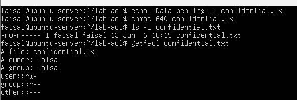

2. Beri akses baca ke satu user tertentu tanpa mengubah owner atau group
```
setfacl -m u : userA : r confidential . txt
ls -l confidential . txt
getfacl confidential . txt
```
Hasil :

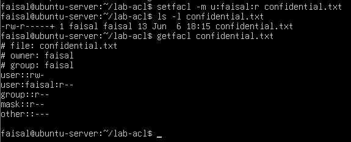

3. Buat direktori bersama yang mewariskan ACL ke file baru
```
mkdir shared
setfacl -d -m u : userA : rwx shared
setfacl -d -m u : userB :r - x shared
getfacl shared
touch shared / inherited . txt
getfacl shared / inherited . txt
```
Hasil :

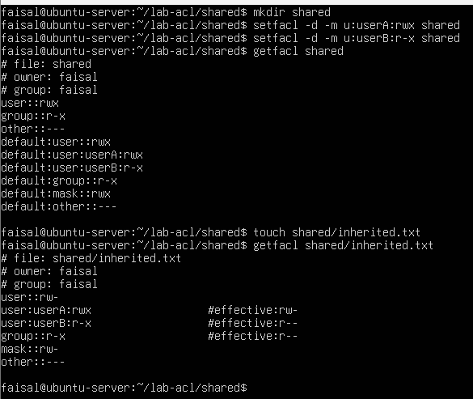

Analisis
1. Mengapa getfacl confidential.txt awalnya tidak menampilkan user tertentu?
2. Setelah setfacl -m u:userA:r confidential.txt, apa perbedaan output ls -l dan getfacl?
3. Mengapa file inherited.txt mewarisi ACL dari direktori shared?

Jawaban :

1. Karena pada saat tahap itu (digambar step 1) file tersebut belum memiliki aturan ACL khusus. output yang keluar hanya terjemahan dari standar permission 640 biasa
2. Pada ls -l: Outputnya berubah menjadi -rw-r-----+
Pada getfacl: Outputnya sekarang jauh lebih detail. Muncul baris baru yaitu user:faisal:r--.Ini berarti sistem mencatat secara spesifik bahwa user faisal memiliki hak baca (r)
3. File tersebut ACL karena saat mengatur ACL pada direktori shared, menambahkan parameter -d(default). setfacl -d -m u:userA:rwx shared


## Praktikum 11.3A — Membuat dan Mengelola User
```
# buat dua user
sudo useradd -m -s / bin / bash userA
sudo useradd -m -s / bin / bash userB
sudo passwd userA
sudo passwd userB
# verifikasi
id userA
getent passwd userA
# modifikasi shell userA
sudo usermod -s / bin / zsh userA
getent passwd userA
# lock dan unlock userB
sudo usermod -L userB
sudo passwd -S userB
sudo usermod -U userB
sudo passwd -S userB
```
Hasil :

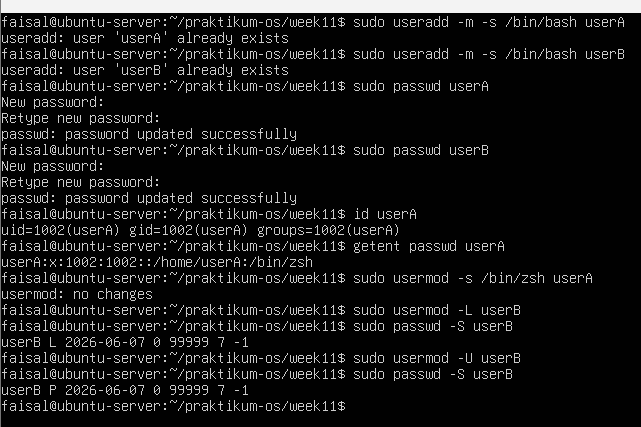

Pertanyaan 
1. Apa perbedaan output id userA sebelum dan sesudah menambah group?
2. Bagaimana status passwd -S userB berubah saat akun di-lock?

Jawaban:

1. Sebelum ditambah grup: Output menunjukkan: uid=1002(userA) gid=1002(userA) groups=1002(userA)
Sesudah ditambah grup:
Jika nanti memasukkan userA ke grup lain (misalnya grup sudo atau labgroup), bagian groups= akan bertambah panjang. Outputnya akan terlihat seperti :
uid=1002(userA) gid=1002(userA) groups=1002(userA), 27(sudo), 1005(labgroup)
2. Saat Di-lock (usermod -L userB):
Output: userB L 2026-06-07... Huruf L adalah singkatan dari Locked (Terkunci)
Saat Di-unlock (usermod -U userB):
Output: userB P 2026-06-07... Huruf P adalah singkatan dari Password Set (atau Usable/Dapat digunakan)


## Praktikum 11.3B — Group Management
```
# buat dua group
sudo groupadd labgroup
sudo groupadd readonly - group
# tambahkan userA ke kedua group
sudo usermod - aG labgroup , readonly - group userA
# tambahkan userB hanya ke readonly - group
sudo usermod - aG readonly - group userB
# verifikasi
id userA
id userB
getent group labgroup
getent group readonly - group
```
Hasil :

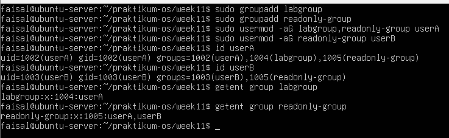

Pertanyaan:
1. Apa yang ditampilkan id userA vs groups userA?
2. Mengapa -a pada usermod -aG penting?

Jawaban:

1. id userA : Menampilkan informasi identitas secara mendalam, termasuk ID angka (User ID / UID dan Group ID / GID). Outputnya memisahkan mana grup utama (gid=1002)
groups userA: Tampilan sederhana yang hanya menampilkan daftar nama grup yang diikutinya dalam format teks dan Outputnya hanya akan terlihat seperti ini: userA : userA labgroup readonly-group
2. Jika tidak menggunakan -a dan hanya mengetik sudo usermod -G labgroup userA, maka sistem akan menghapus/mengeluarkan userA dari semua grup tambahan lamanya, dan menggantinya hanya dengan labgroup


## Praktikum 11.3C — Password Aging Policy
```
# set aging policy untuk userA
sudo chage -M 60 -W 7 -m 1 userA
sudo chage -l userA
# paksa userA ganti password saat login pertama
sudo chage -d 0 userA
# kunci password userB
sudo passwd -l userB
sudo passwd -S userB
# unlock kembali
sudo passwd -u userB
sudo passwd -S userB
```
Hasil :

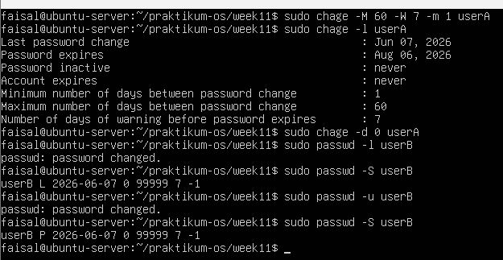

Pertanyaan:
1. Apa arti nilai yang ditampilkan chage -l userA?
2. Bagaimana cara membuktikan userB terkunci dari output passwd -S?
3. Kapan sebaiknya menggunakan chage -d 0 vs passwd -e?

Jawaban:

1. Perintah chage -l (list) menerjemahkan data mentah di dalam sistem menjadi laporan yang mudah dibaca, seperti:
Last password change (Jun 07, 2026): Tanggal terakhir password userA dibuat atau diubah
Password expires (Aug 06, 2026): Tanggal di mana password saat ini akan hangus dan tidak bisa digunakan lagi
Password inactive (never): Masa tenggang (hari) setelah password expired sebelum akun benar-benar dilumpuhkan
Account expires (never): Tanggal kedaluwarsa untuk akun itu sendiri (bukan password-nya)
Minimum number of days between password change (1): Hasil dari argumen -m 1. Artinya, setelah userA mengganti password, harus menunggu minimal 1 hari sebelum boleh menggantinya lagi
Maximum number of days between password change (60): Hasil dari argumen -M 60. Usia maksimal password sebelum wajib diganti
Number of days of warning (7): Hasil dari argumen -W 7. Tujuh hari sebelum tanggal 6 Agustus, setiap kali userA login, layar terminalnya akan memunculkan peringatan "Warning: your password will expire in X days"
2. Saat Terkunci: Setelah perintah sudo passwd -l userB (opsi -l untuk lock), Output-nya adalah userB L 2026-06-07.... Huruf L (Locked) adalah bukti mutlak bahwa akun tersebut ditangguhkan
Saat Dibuka Kembali: Setelah perintah sudo passwd -u userB (opsi -u untuk unlock), statusnya berubah menjadi userB P 2026-06-07.... Huruf P (Password set/usable) membuktikan bahwa akun tersebut bisa digunakan lagi untuk login
3. Gunakan passwd -e untuk kebutuhan sehari-hari (mereset password staf yang lupa), dan gunakan chage khusus saat sedang mengatur regulasi/kebijakan keamanan (password aging policy)


## Praktikum 11.4 — Konfigurasi sudo
1. Buat file konfigurasi sudo khusus untuk userA
```
sudo visudo -f / etc / sudoers . d / lab - userA
```
Hasil :

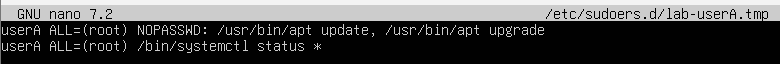

2. Verifikasi aturan yang aktif dan uji hasilnya
```
sudo -l -U userA
sudo grep " userA " / var / log / auth . log | tail -10
```
Hasil :

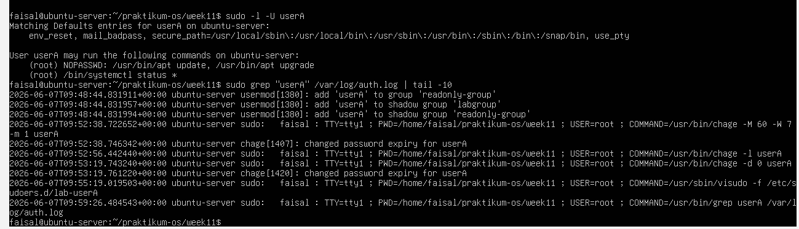

Analisis
1. Mengapa aturan disimpan di /etc/sudoers.d//, bukan langsung di /etc/sudoers?
2. Mana perintah yang bisa dijalankan tanpa password, dan mana yang masih perlu autentikasi?
3. Informasi apa saja yang dicatat di log sudo?

Jawaban:

1. bisa membuat satu file terpisah untuk setiap user atau layanan (misal: file lab-userA, file web-admin, file database-backup). Jika suatu saat userA sudah tidak bekerja lagi, kamu cukup menghapus file lab-userA tanpa perlu repot mencari dan menghapus baris teks di dalam file induk /etc/sudoers. serta aman dari pembaruan sistem
Mengurangi risiko fatal seperti salah mengetik di file utama /etc/sudoers dan menyimpannya, hal itu bisa merusak akses sudo untuk semua orang di server, membuat terkunci dari server sendiri
2. Tanpa Password : Perintah /usr/bin/apt update dan /usr/bin/apt upgrade
Memerlukan Password (Perlu Autentikasi):
Perintah /bin/systemctl status *
3. Waktu (Timestamp): Kapan kejadiannya berlangsung seperti: 2026-06-07T09:59:26...
Nama Host (Hostname): Seperti pada gambar menampilkan ubuntu-server.
Layanan yang Melapor: Program yang mengeksekusi (sudo).
Siapa User mana yang mengetikkan perintah : seprti pada gambar yaitu faisal
Lokasi Terminal (TTY): seprti pada gambar menampilkan tty1, atau pts/0 jika via SSH
Lokasi Direktori (PWD): Di folder mana posisi user saat mengetik perintah (/home/faisal/praktikum-os/week11)
Bertindak Sebagai Siapa (USER): Hak akses siapa yang dipinjam biasanya USER=root
Perintah Persis (COMMAND): Apa yang sebenarnya diketik dan dieksekusi misal: COMMAND=/usr/bin/grep userA /var/log/auth.log


## Praktikum 11.5 — Disk Quota
1. Buat image filesystem kecil dan mount dengan opsi quota
```
sudo dd if =/ dev / zero of =/ tmp / quota - test . img bs =1 M count =100
sudo mkfs . ext4 / tmp / quota - test . img
sudo mkdir -p / mnt / quota - test
sudo mount -o loop , usrquota , grpquota / tmp / quota - test . img / mnt /
quota - test
```
Hasil :

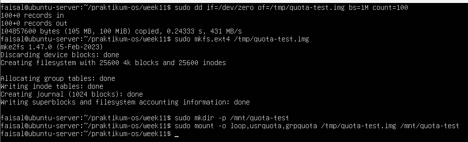

2. Buat database quota dan aktifkan enforcement
```
sudo quotacheck - cug / mnt / quota - test
sudo quotaon -v / mnt / quota - test
sudo repquota / mnt / quota - test
```
Hasil :
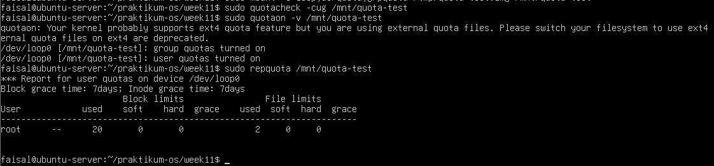

3. Tetapkan quota untuk user uji dan amati hasilnya
```
sudo edquota -u userA
# contoh : soft block 5120 , hard block 10240
sudo repquota / mnt / quota - test
```
Hasil :
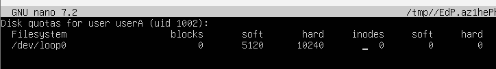
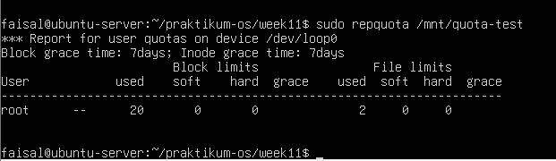

4. Bersihkan lingkungan uji setelah selesai
```
sudo quotaoff / mnt / quota - test
sudo umount / mnt / quota - test
sudo rm / tmp / quota - test . img
```
Hasil :
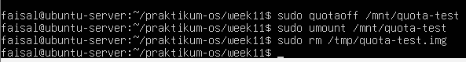

Analisis
1. Apa perbedaan soft limit dan hard limit saat quota mulai terlampaui?
2. Mengapa praktikum ini memakai loopback filesystem, bukan langsung /home/?
3. Dari output repquota, informasi apa yang menunjukkan quota sudah aktif?

Jawaban:

1.  soft limit : Ini adalah ambang batas pertama. Jika user menyimpan data melewati angka soft limit (contoh: 5120 blocks / sekitar 5MB), sistem masih akan mengizinkan user tersebut menyimpan file barunya. Namun, sebuah timer peringatan akan mulai berjalan mundur
hard limit: Jika user mencoba menyimpan file yang membuat total kapasitasnya menyentuh atau melewati angka hard limit (contoh: 10240 blocks / sekitar 10MB), sistem akan langsung menolak dan menggagalkan proses tersebut secara instan
2. dengan loopback berarti membuat sebuah sandbox yang aman. Jika ada masalah, tinggal menghapus file .img tersebut tanpa berdampak apa pun pada sistem operasi utama
3. Tepat di atas perintah repquota, ada output dari perintah quotaon, yaitu user quotas turned on dan group quotas turned on. Output memunculkan kalimat *** Report for user quotas on device /dev/loop0. Selain itu, tampilnya tabel dengan kolom-kolom parameter batas (soft, hard, grace, used) serta terdaftarnya user root dengan penggunaan ruang 20 blocks.
Jika quota dalam keadaan mati (off) atau database-nya belum diinisialisasi, perintah repquota tidak akan menampilkan tabel ini dan akan memunculkan error seperti "Quota not active" atau sekadar kosong.