# Laporan Praktikum Sistem Operasi Jobsheet 12

<h4>Nama : Faisal Rizky <h4>
<h4>NIM : 254107020224 <h4>
<h4>Kelas : TI-1H <h4>

## Praktikum 12.1: Amati Layanan Aktif Saat Boot
1. Lihat semua layanan yang sedang berjalan.
```
systemctl list - units -- type = service -- state = running
# catat berapa banyak layanan yang aktif
```
Hasil:
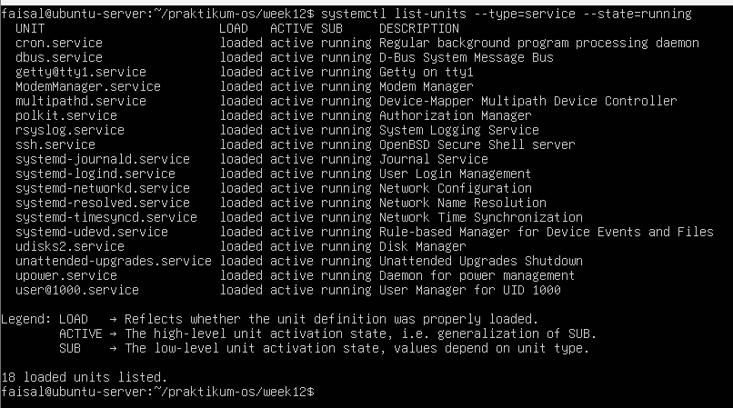

2. Lihat semua unit service yang ada (aktif maupun tidak).
```
systemctl list - unit - files -- type = service | head -30
# enabled = akan start otomatis saat boot
# disabled = tidak start otomatis , bisa dijalankan manual
# static = tidak bisa di - enable / disable , hanya dipanggil oleh layanan lain
```
Hasil:
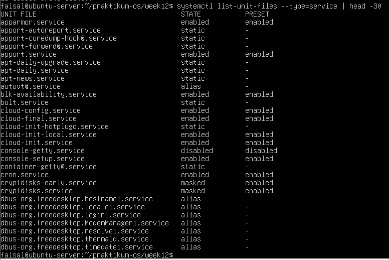

3. Analisis waktu boot dan temukan layanan paling lambat.
```
systemd - analyze
systemd - analyze blame | head -15
```
Hasil:
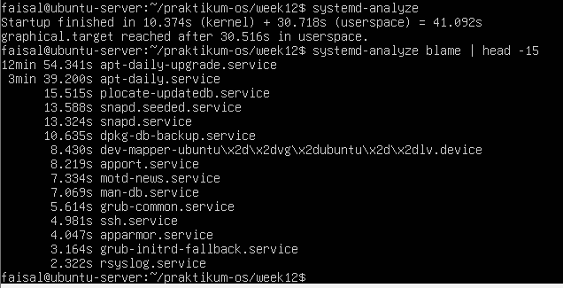


## Praktikum 12.2: Kelola Layanan SSH
1. Periksa status SSH secara menyeluruh.
```
systemctl status ssh
systemctl is - active ssh
systemctl is - enabled ssh
```
Hasil:
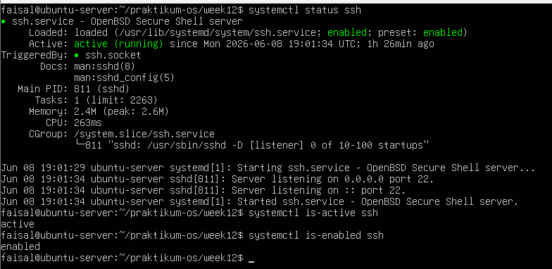

2. Lakukan restart dan pantau perubahannya.
```
sudo systemctl restart ssh
systemctl status ssh
# perhatikan : Loaded , Active , dan Main PID bisa berubah setelah restart
```
Hasil:
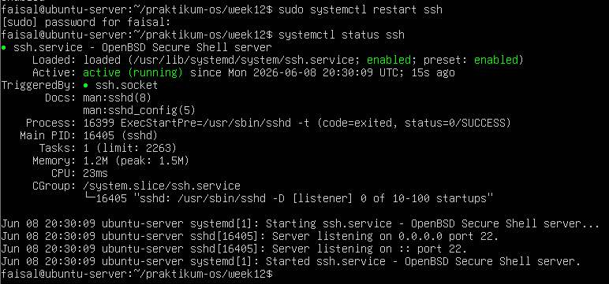

3. Lihat dependensi SSH.
```
systemctl list - dependencies ssh
# layanan lain yang harus aktif sebelum SSH bisa berjalan
```
Hasil:
 

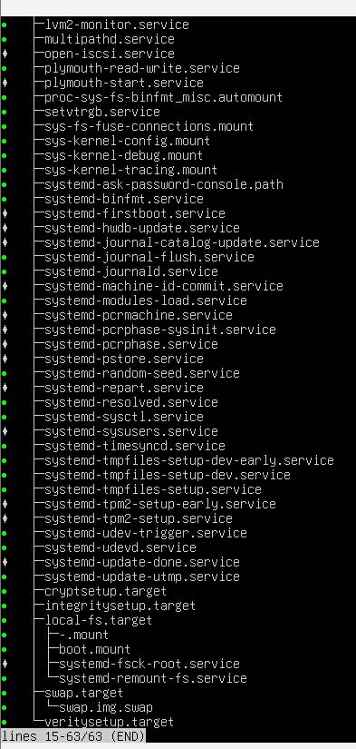

4. Cek semua unit yang gagal di sistem.
```
systemctl -- failed
# jika ada , ini adalah daftar layanan yang butuh perhatian
```
Hasil:
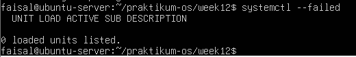


## Praktikum 12.3: Buat Layanan Sederhana dari Skrip Bash
1. Siapkan konten yang akan dilayani.
```
cd ~/ lab - os / chapter10 - services
mkdir -p situs - demo
nano situs - demo / index . html
# Tulis isi berkas berikut
<! DOCTYPE html >
< html >
< body >
<h1 > Halo dari layanan systemd kustom ! </ h1 >
<p > Layanan ini dibuat pada praktek Bab 10. </ p >
</ body >
</ html >
```
Hasil:
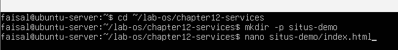
 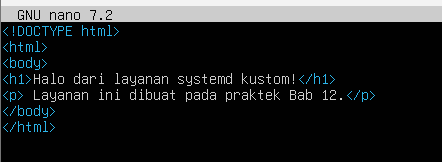

2. Buat skrip wrapper untuk server HTTP.
```
nano ~/ lab - os / chapter10 - services / jalankan - server . sh
# Tulis isi berkas berikut
#!/ bin / bash
DIREKTORI =" $HOME /lab -os/ chapter10 - services /situs - demo "
PORT =9090
echo " Memulai server di port $PORT ..."
exec python3 -m http . server $PORT -- directory " $DIREKTORI "
chmod + x ~/ lab - os / chapter10 - services / jalankan - server . sh
```
Hasil:
 
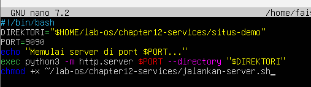

3. Buat berkas unit systemd untuk layanan ini.
```
nano ~/ lab - os / chapter10 - services / demo - web . service
# Tulis isi berkas berikut
[ Unit ]
Description = Demo Web Server Praktek Bab 10
After = network . target
[ Service ]
Type = simple
User = nama - pengguna - kamu
WorkingDirectory =/ home / nama - pengguna - kamu / lab - os / chapter10 - services /
situs - demo
ExecStart =/ usr / bin / python3 -m http . server 9090
Restart = on - failure
RestartSec =3 s
[ Install ]
WantedBy = multi - user . target
# salin ke lokasi unit systemd
sudo cp ~/ lab - os / chapter10 - services / demo - web . service / etc / systemd /
system / demo - web . service
# minta systemd membaca ulang berkas unit yang baru dibuat
sudo systemctl daemon - reload
```
Hasil:
 
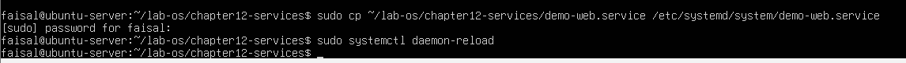 
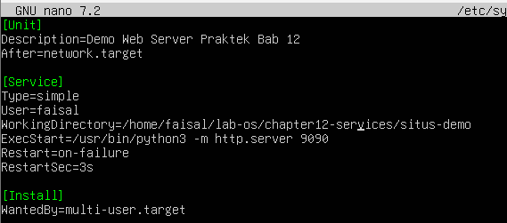

4. Jalankan layanan dan verifikasi.
```
sudo systemctl start demo - web
systemctl status demo - web
# coba akses layanan
curl http :// localhost :9090
```
Hasil:
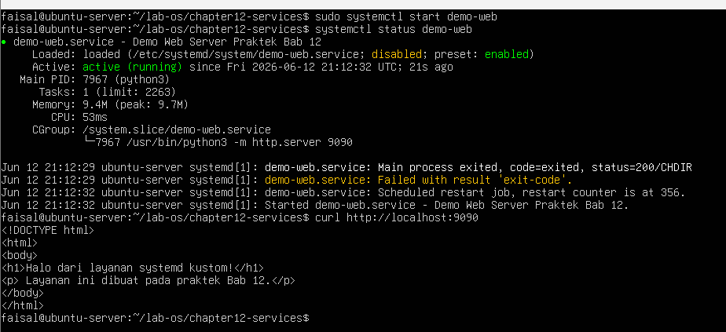

5. Uji fitur restart otomatis.
```
# lihat PID proses saat ini
systemctl status demo - web | grep " Main PID"
# hentikan proses secara paksa ( simulasi crash )
sudo kill -9 $ ( systemctl show demo - web -- property = MainPID -- value )
# tunggu beberapa detik lalu cek -- systemd harus menghidupkannya
kembali
sleep 5
systemctl status demo - web
# PID akan berubah karena proses baru dijalankan
```
Hasil:
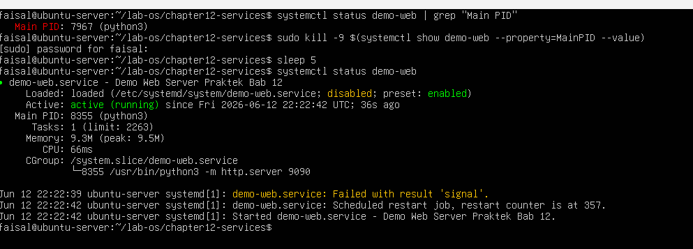

6. Bersihkan layanan uji setelah selesai.
```
sudo systemctl disable -- now demo - web
sudo rm / etc / systemd / system / demo - web . service
sudo systemctl daemon - reload
```
Hasil:
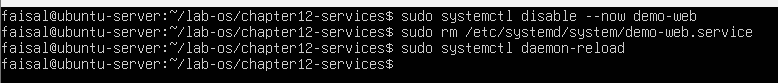


## Praktikum 12.4: Filter dan Analisis Log Layanan
1. Lihat log SSH dari satu jam terakhir.
```
journalctl -u ssh -- since "1 hour ago" --no - pager
# jika tidak ada log SSH , gunakan layanan lain yang aktif
journalctl -u cron -- since "1 hour ago" --no - pager
```
Hasil:
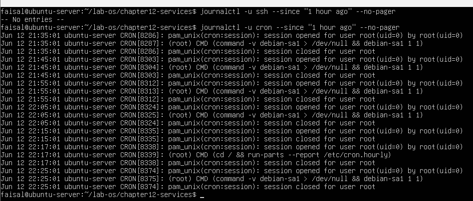

2. Filter log berprioritas error ke atas.
```
journalctl -b -p err --no - pager
# ini menampilkan semua error dan yang lebih serius sejak boot
```
Hasil:
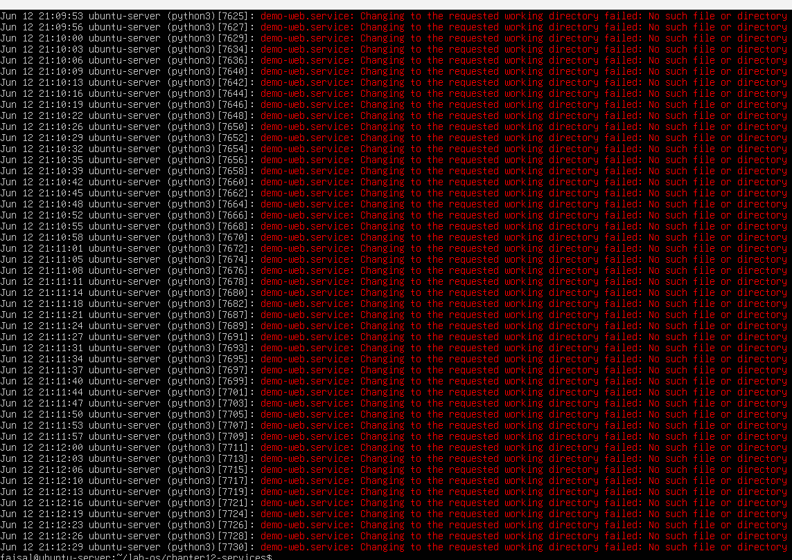

3. Ikuti log secara real-time sambil memicu aktivitas.
```
# jalankan di terminal pertama :
journalctl -u ssh -f
# di terminal kedua , coba login SSH ke localhost
# ssh localhost
# lalu lihat apa yang muncul di terminal pertama
```
Hasil:
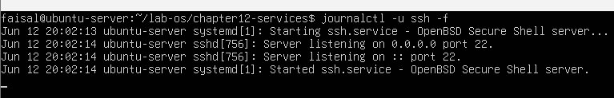 
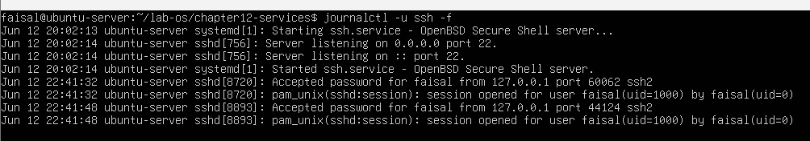

4. Ekstrak log ke berkas untuk analisis.
```
cd ~/ lab - os / chapter10 - services
# simpan semua log layanan ssh dari hari ini ke berkas
journalctl -u ssh -- since today --no - pager > log - ssh - hari - ini . txt
# hitung jumlah baris log
wc -l log - ssh - hari - ini . txt
# jika ada , cari baris yang mengandung kata " error " atau " failed "
grep -i " error \| failed " log - ssh - hari - ini . txt | head -20
```
Hasil:
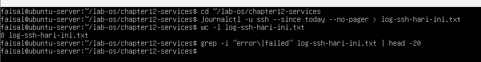


## Praktikum 12.5: Konfigurasi SSH Server
1. Periksa konfigurasi SSH saat ini.
```
sudo grep -n "^ Port \|^# Port " / etc / ssh / sshd_config
ss - tlnp | grep ssh
```
Hasil:
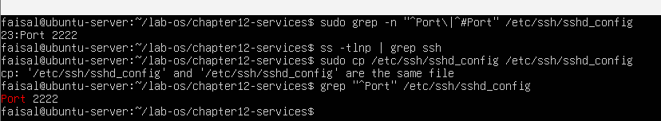

2. Buat backup dan ubah port SSH.
```
sudo cp / etc / ssh / sshd_config / etc / ssh / sshd_config . backup . lab12
# ubah port dari 22 ke 2222 ( atau port lain yang belum dipakai )
sudo sed -i 's /^# Port 22/ Port 2222/ ' / etc / ssh / sshd_config
# jika baris Port 22 tidak dikomentari :
# sudo sed -i 's/^ Port 22/ Port 2222/ ' /etc/ssh/ sshd_config
# verifikasi perubahan
grep "^ Port " / etc / ssh / sshd_config
```
Hasil:


3. Validasi konfigurasi dan restart layanan.
```
# WAJIB : validasi sintaks sebelum restart
sudo sshd -t
echo " Kode keluar sshd -t: $?"
# kode 0 berarti sintaks valid
# restart layanan
sudo systemctl restart ssh
systemctl status ssh
```
Hasil:
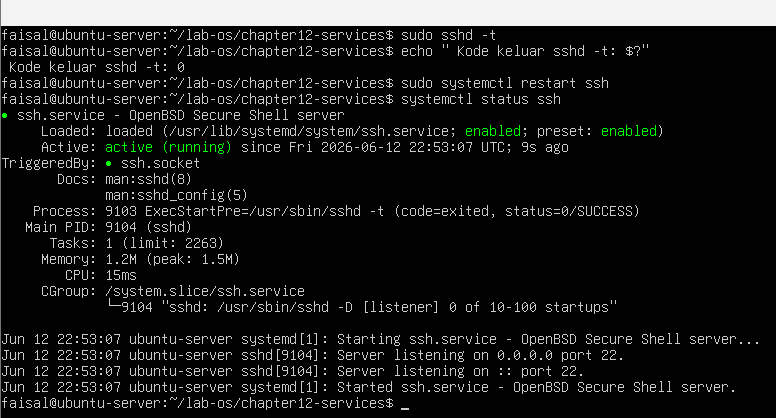

4. Verifikasi port baru dengan ss.
```
ss - tlnp | grep ssh
# seharusnya menampilkan port 2222 , bukan 22
# simpan hasil ke berkas bukti
ss - tlnp | grep ssh > ~/ lab - os / chapter10 - services / bukti - port - ssh . txt
cat ~/ lab - os / chapter10 - services / bukti - port - ssh . txt
```
Hasil:
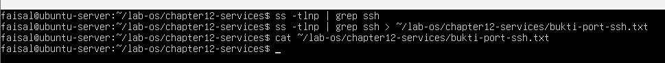

5. Kembalikan port SSH ke 22 setelah praktek.
```
sudo cp / etc / ssh / sshd_config . backup . lab12 / etc / ssh / sshd_config
sudo sshd -t
sudo systemctl restart ssh
ss - tlnp | grep ssh
# harus kembali ke port 22
```