# Laporan Praktikum Sistem Operasi Jobsheet 6

<h4>Nama : Faisal Rizky <h4>
<h4>NIM : 254107020224 <h4>
<h4>Kelas : TI-1H <h4>

## Praktikum 6.1 — Melihat Proses dan Thread
1. Tampilkan semua proses yang berjalan:
```
ps aux

```
Hasil :
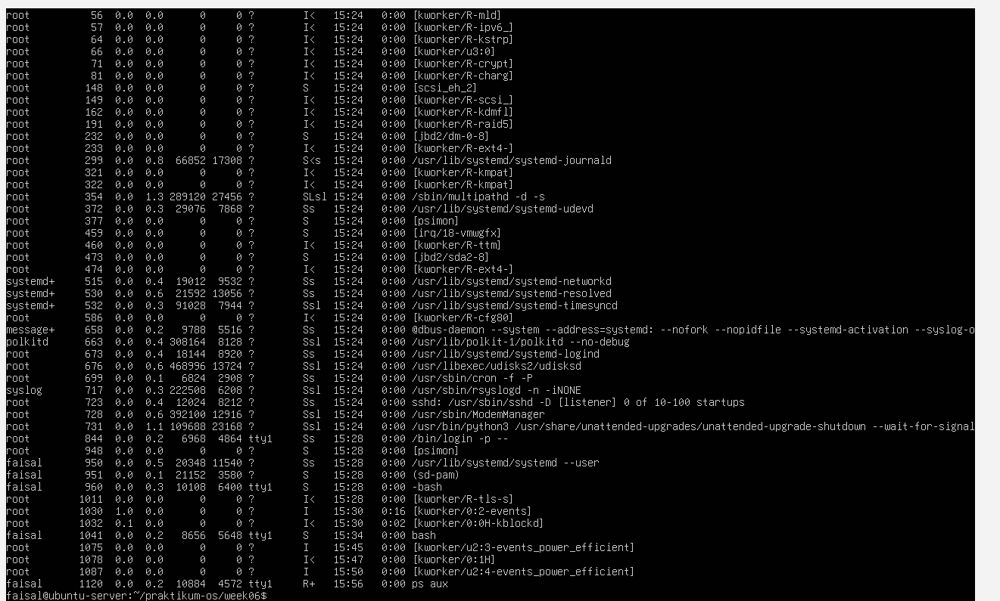

2. Tampilkan proses beserta thread-nya, dapat dilihat pada kolom LWP (Light Weight Process ID):
```
ps aux -L

```
Hasil :
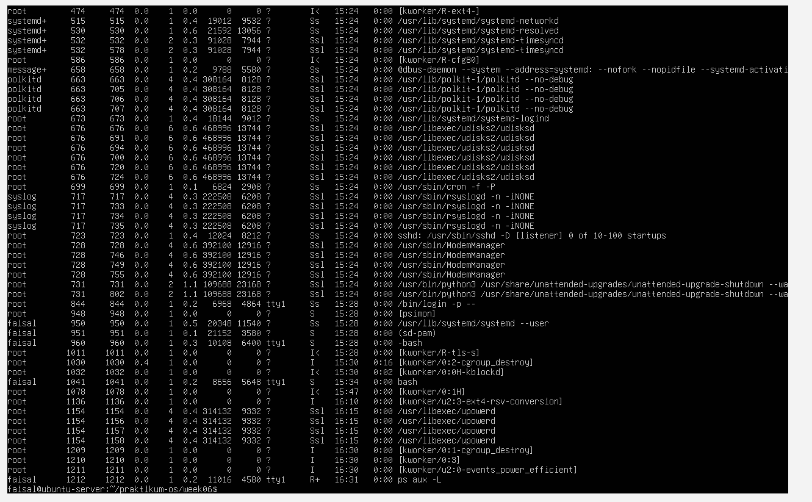

3. Lihat PID shell aktif dan detail prosesnya:
```
echo $$
ps -p $$ -f

```
Hasil :
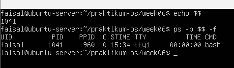

4. Lihat hierarki proses secara visual:
```
pstree -p

```
Hasil :
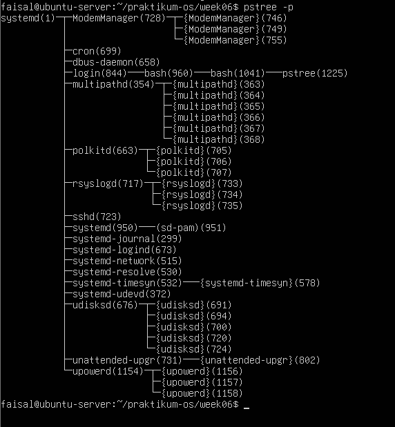

### Latihan 6.1
Jalankan ps aux dan amati outputnya:

1. Berapakah total proses yang berjalan ? Proses apa yang memiliki PID terkecil ?

Jawaban :

Totalnya ada 100 proses yang berjalan dan yang memiliki PID terkecil yaitu /sbin/init dengan user root


2. Jalankan pstree -p dan temukan proses bash anda. Proses apa yang menjadi induk (PPID) dari bash tersebut ?

Jawaban :

PPID nya adalah bash(960)


3. Bandingkan output ps aux dan ps aux -L. Apa perbedaan yang anda lihat ?

Jawaban : 

Perbedaan pada 2 command tersebut ada pada hasilnya, jika 
ps aux -L ada LWP (Light Weight Process ID) dan NLWP (Number of Light Weight Processes)
sedangkan jika ps aux saja tidak ada LWP dan NLWP


## Praktikum 6.2 — Mengamati Siklus Hidup Proses
1. Buat proses di background dan amati kondisinya:
```
sleep 60 &
ps aux | grep sleep

```
Hasil :

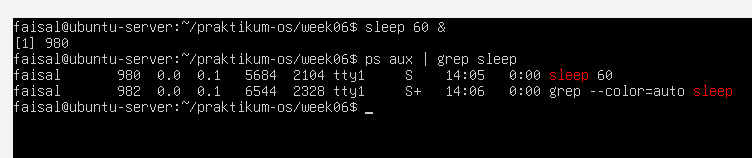

2. Amati perubahan exit code dari perintah yang berhasil dan gagal:
```
ls /tmp
echo "Sukses: $?"

ls /direktori-tidak-ada
echo "Gagal: $?"

```
Hasil :

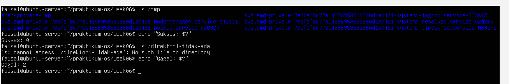

### Latihan 6.2
1. Jalankan sleep 120 & dan amati kolom STAT pada ps aux. Kondisi apa yang ditampilkan? Mengapa proses sleep berada di kondisi tersebut?

Jawaban :

kondisi yang ditampilan yaitu STAT nya memiliki kondisi S. Karena menunggu (menghitung mundur timer) selama 120 detik tanpa melakukan komputasi aktif yang membebani prosesor (CPU)


2. Jalankan beberapa perintah yang berhasil dan yang gagal, lalu catat exit code masing-masing. Pola apa yang anda temukan ?

Jawaban :

Yang berhasil :

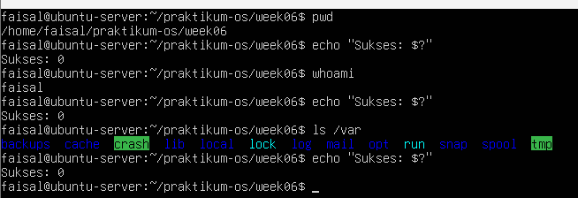

Yang gagal :

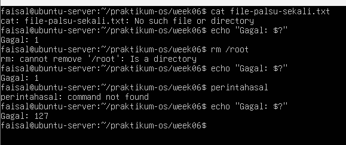

yang berhasil exit code nya selalu 0, sedangkan yang gagal exit codenya selain 0.

## Praktikum 6.3 — Mengatur Prioritas Proses
1. Jalankan proses dengan prioritas rendah:
```
nice -n 10 sleep 300 &

```

Hasil :
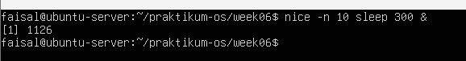

2. Verifikasi nilai nice pada kolom NI:
```
ps aux | grep sleep

```

Hasil :
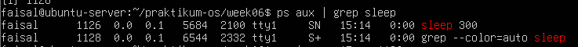


3. Ubah nilai nice proses yang sudah berjalan:
```
renice -n 15 -p <PID>
ps -p <PID> -o pid , ni , cmd

```

Hasil :
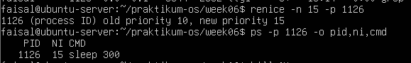

4. Bersihkan proses percobaan:
```
kill %1

```
Hasil :
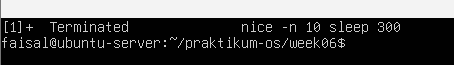

### Latihan 6.3
1. jalankan nice -n 5 sleep 200 & dan verifikasi nilai NI-nya dengan ps

Jawaban : 
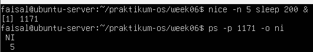

2. Ubah nilai nice menjadi 10 menggunakan renice, lalu verifikasi kembali

Jawaban :
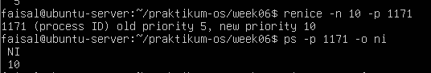

3. Coba ubah nilai nice menjadi -5 tanpa sudo. Apa yang terjadi ? Mengapa Linux membatasi hal ini untuk user biasa ?

Jawaban :
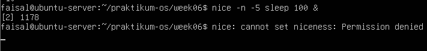
Karena, pengguna biasa tidak bisa mengubah apa yang hanya bisa diubah oleh pengguna prioritas atai VIP, yaitu meminta lebih banyak ruang cpu, bisa meminta jika memakai sudo


## Praktikum 6.4 — Mengirim Sinyal ke Proses
1. Buat proses percobaan:
```
sleep 500 &
sleep 600 & 
sleep 700 &
ps aux | grep -v grep | grep sleep

```
Hasil: 
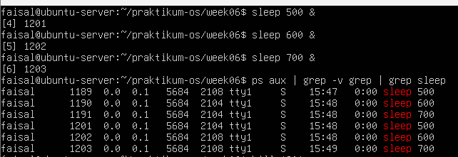


2. Hentikan satu proses dengan SIGTERM dan verifikasi:
```
kill <PID-sleep-500>
ps aux | grep -v grep | grep sleep

```
Hasil :
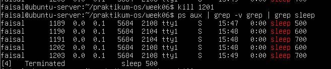

3. jeda dan lanjutkan proses dengan SIGSTOP/SIGCONT:
```
kill -SIGSTOP <PID-sleeo-600>
ps aux | grep sleep  # amati kolom STAT : berubah menjadi T  

kill -SIGCONT <PID-sleep-600>
ps aux | grep sleep  # STAT kembali ke S

```
Hasil :
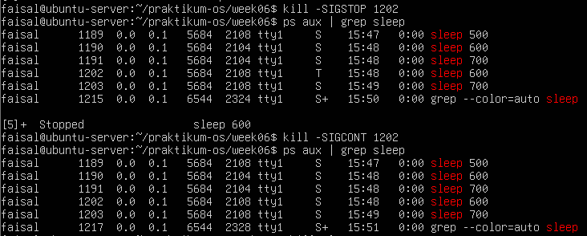

4. Hentikan semua proses sleep sekaligus:
```
pkill sleep

```
Hasil :
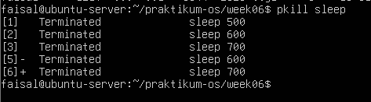

### Latihan 6.4
1. Jalankan sleep 400 &, kirim SIGSTOP, dan amati perubahan kolom STAT. Kondisi apa yang muncul?

Jawaban :
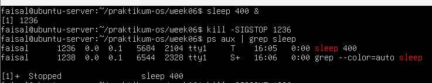
yang muncul huruf T, yang berarti Stopped atau Traced. menunjukkan bahwa telah dibekukan atau di-pause dari penggunaan CPU, tapi programnya tidak dimatikan sepenuhnya

2. Kirim SIGCONT dan verifikasi proses kembali berjalan.

Jawaban :
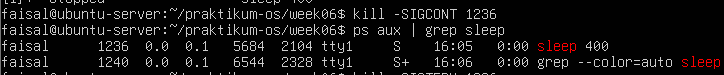
proses kembali berjalan, ditunjukkan dengan berubahnya kembali huruf di kolom STAT dari T (Stopped) menjadi S (Interruptible Sleep)

3. Hentikan proses dengan SIGTERM lalu verifikasi sudah tidak ada. Kapan Anda memilih SIGKILL daripada SIGTERM?

Jawaban :
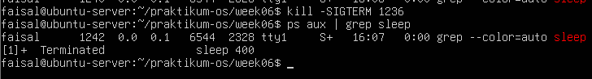
menggunakan SIGKILL sebagai cara terakhir ketika cara SIGTERM tidak berfungsi atau tidak berpengaruh.kenapa SIGKILL sebagai cara terkahir ? karena penggunaan SIGKILL di awal dapat menyebabkan data rusak/korup jika program dimatikan paksa saat sedang menulis data

## Praktikum 6.5 — Manajemen Job Foreground dan Background
1. Jalankan tiga job di background:
```
sleep 200 &
sleep 300 &
sleep 400 &
jobs

```
Hasil :
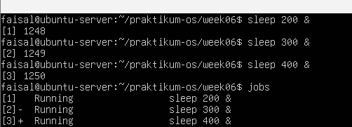

2. Bawa job pertama ke foreground, jeda, lalu kembali ke background:
```
fg %1
# Tekan CTRL+Z untuk menjeda
bg %1
jobs

```
Hasil :
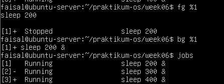

3. Hentikan semua job:
```
kill %1 %2 %3
jobs

```
Hasil :
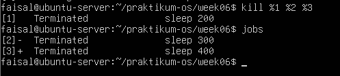


### Latihan 6.5
1. Jalankan top di foreground. Apa yang terjadi di terminal?

Jawaban :
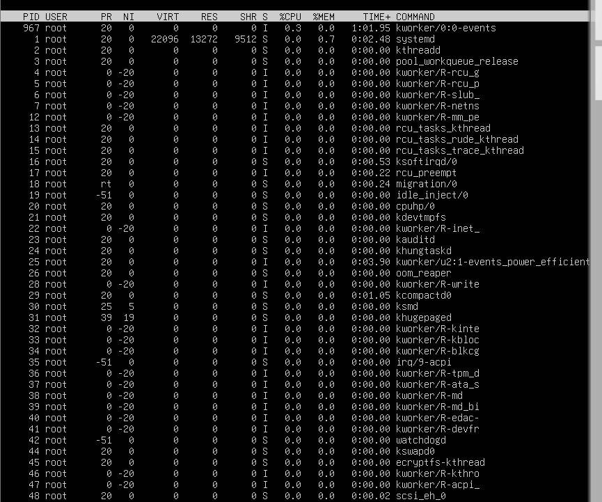
Saat menjalankan top di foreground, terminal langsung berubah menjadi dashboard interaktif yang menampilkan penggunaan CPU, RAM, dan daftar proses secara real-time. Terminal menjadi "terkunci" atau dikuasai oleh program top, sehingga tidak bisa mengetik command line biasa sampai program tersebut dihentikan

2. Tekan Ctrl+Z dan cek statusnya dengan jobs. Kondisi apa yang ditampilkan?

Jawaban :
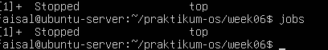
Stopped, yang berrati eksekusi program top telah dibekukan sementara (di-pause) dan kendali layar terminal dikembalikan kepada pengguna

3. Pindahkan ke background dengan bg. Apakah top dapat berjalan dengan baik di background? Mengapa?

Jawaban :
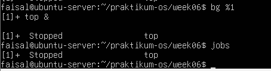
program top tidak dapat berjalan dengan semestinya di latar belakang (background). Karena, top adalah program berbasis antarmuka teks (TUI - Text User Interface) yang sifat dasarnya wajib memiliki akses ke layar terminal (TTY) untuk terus-menerus mencetak dan memperbarui datanya

4. Kembalikan ke foreground dengan fg, lalu keluar dengan q .

Jawaban :
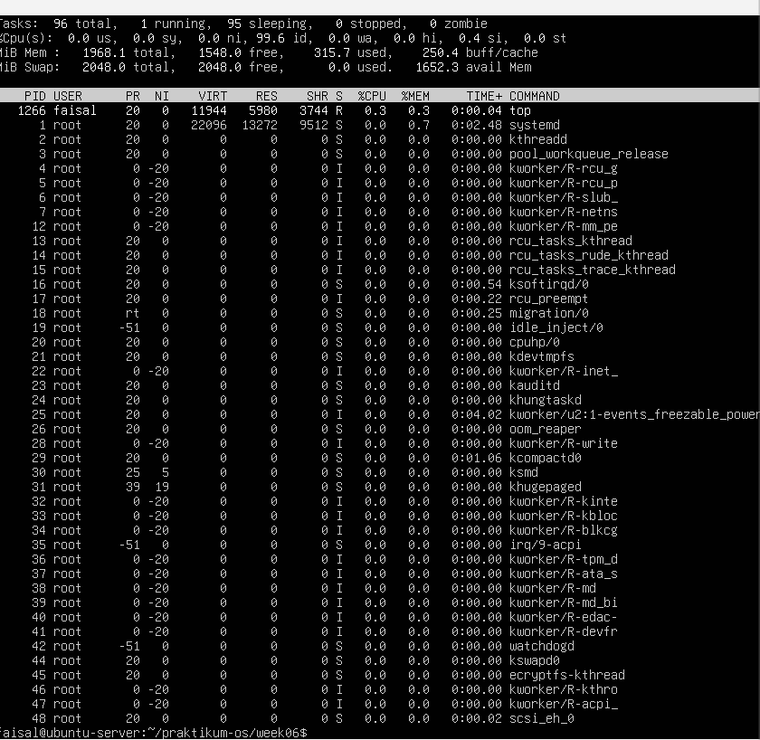

## Praktikum 6.6 — Pemantauan Proses
1. Temukan proses dengan penggunakan CPU dan memori tinggi:
```
ps aux --sort=-%cpu | head -10
ps aux --sort=-%mem | head -10

```
Hasil :
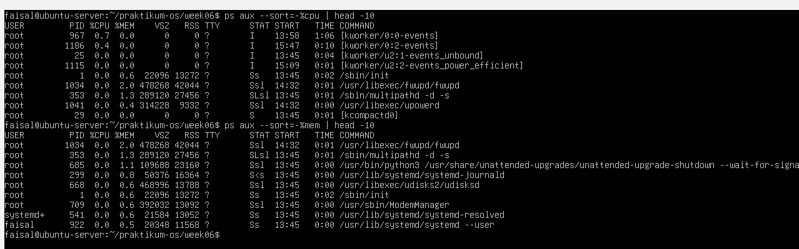

2. Jalankan top dan eksplorasi shortcut-nya:
```
top
# Tekan M, P, 1 , u secara bergantian
# Tekan q untuk keluar

```
Hasil :
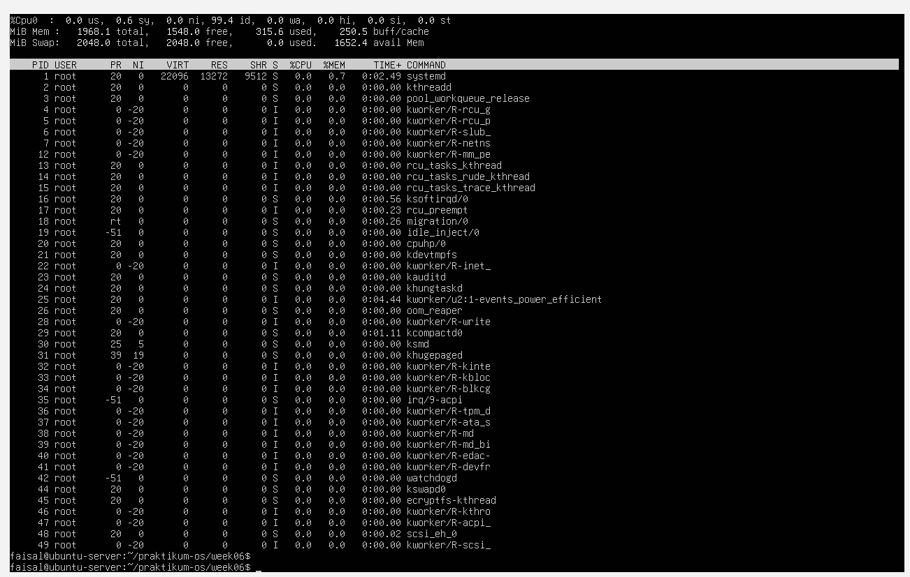

3. Install dan jalankan htop:
```
sudo apt install -y htop
htop
# Tekan F6 untuk pilih kolom pengurutan
# Tekan F10 atau q untuk keluar

```
Hasil :
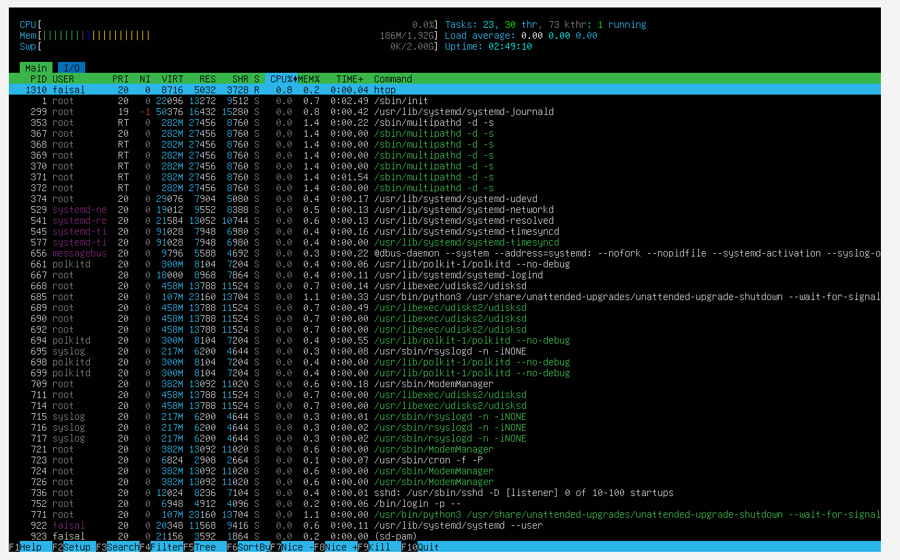

### Latihan 6.6
1. Gunakan ps aux –sort=%mem untuk menemukan proses yang menggunakan memori paling banyak di VM Anda. Proses apa itu?

Jawaban :
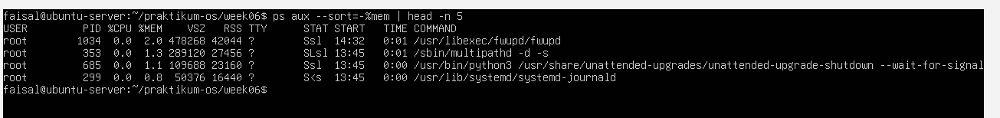
proses yang menggunakan memori paling banyak saat ini adalah /usr/libexec/fwupd/fwupd dengan penggunaan memori sebesar 2.0%.

2. Di dalam top, tekan 1. Apa yang berubah pada tampilan? Mengapa informasi ini berguna?

Jawaban :
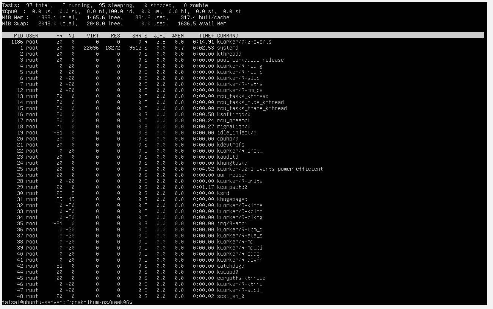
Saat angka 1 ditekan, ringkasan beban CPU di bagian atas layar berubah. Tampilan yang awalnya hanya menampilkan satu baris rata-rata total beban CPU (%Cpu(s)),terpecah menjadi beberapa baris yang menampilkan detail beban kerja pada masing-masing inti prosesor atau core secara terpisah (misalnya %Cpu0, %Cpu1, dst.)

3. Di dalam htop, navigasikan ke proses sshd menggunakan tombol panah. Tekan F9 dan amati opsi sinyal yang tersedia.

Jawaban :

 


## LATIHAN 
### Latihan 6.A - Eksplorasi Proses Sistem
1. Jalankan ps aux –forest dan temukan proses dengan PID 1. Apa nama dan fungsi proses tersebut dalam sistem Linux modern?

Jawaban :
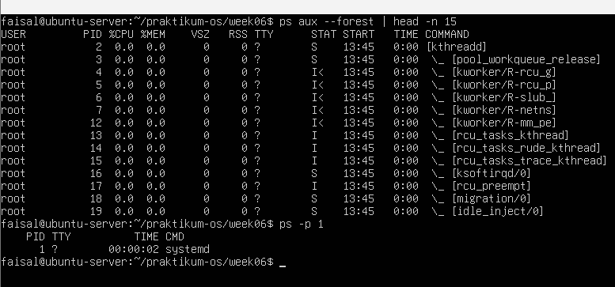
Proses dengan PID 1 bernama systemd, Fungsinya dalam sistem Linux adalah sebagai "induk" dari semua proses (Parent of all processes)

2. Hitung berapa proses yang dimiliki oleh user root dan berapa yang dimiliki oleh user Anda. Mengapa root memiliki lebih banyak proses?

Jawaban :
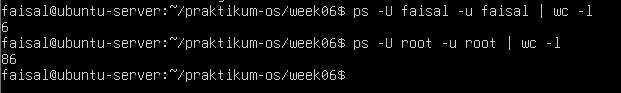
User root memiliki lebih banyak proses karena root memiliki peran menjalankan semua layanan inti di latar belakang, manajemen perangkat keras, jaringan, dan kernel threads (kworkers) diinisialisasi dan dijalankan oleh sistem menggunakan hak akses root sebelum pengguna biasa (user) bahkan melakukan proses login.

3. Temukan semua proses yang berada dalam kondisi S. Mengapa sebagian besar proses di sistem berada dalam kondisi ini?

Jawaban :
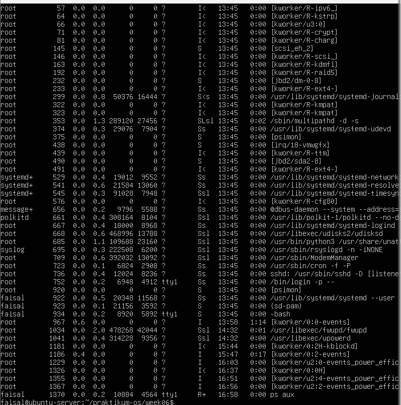
Sebagian besar proses berada dalam kondisi ini karena mereka menghabiskan waktu lebih banyak untuk menunggu daripada memproses data secara aktif

### Latihan 6.B - Simulasi Manajemen Job
1. Jalankan tiga perintah sleep dengan durasi 100, 200, dan 300 detik di background. Verifikasi ketiganya dengan jobs.

Jawaban :
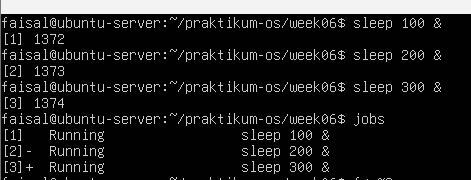

2. Bawa job kedua ke foreground, jeda dengan Ctrl+Z , lalu kembalikan ke background dengan bg.

Jawaban :
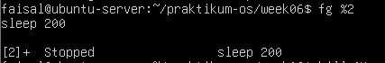

3. Hentikan job pertama dengan kill %1. Tampilkan kembali daftar job. Berapa job yang tersisa?

Jawaban :
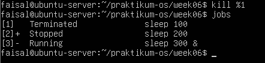

### Latihan 6.C - Prioritas dan Sinyal
1. Jalankan dua proses sleep: satu dengan nice +5 dan satu dengan nice +15. Verifikasi nilai NI keduanya dengan ps.

Jawaban :
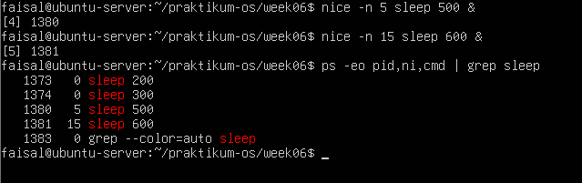

2. Gunakan renice untuk mengubah nice proses pertama menjadi +10. Proses mana yang kini lebih diprioritaskan scheduler?

Jawaban :
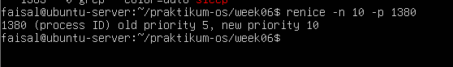
Setelah diubah, proses pertama memiliki nilai Nice +10, sedangkan proses kedua memiliki nilai Nice +15. Proses yang kini lebih diprioritaskan oleh scheduler CPU adalah proses pertama (+10). Semakin kecil atau negatif nilai Nice-nya, semakin tinggi prioritasnya di mata sistem operasi

3. Kirim SIGSTOP ke salah satu proses, verifikasi kondisi T-nya, lalu kirim SIGCONT. Akhiri semua proses percobaan dengan pkill sleep.

Jawaban :
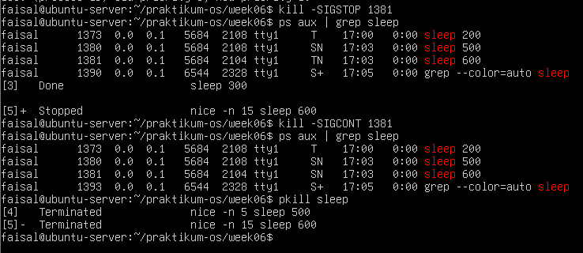