# Laporan Praktikum Sistem Operasi Jobsheet 7

<h4>Nama : Faisal Rizky <h4>
<h4>NIM : 254107020224 <h4>
<h4>Kelas : TI-1H <h4>

## Praktikum 7.1 — Mengenali Bash dan Menyiapkan Workspace
1. Lihat shell login dan shell aktif saat ini:
```
echo "Shell login : $SHELL"
echo "Shell aktif : $0"
bash --version | head -n 1
```
Hasil :
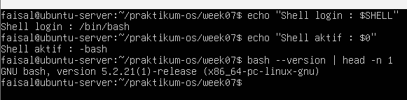

2. Lihat proses shell yang sedang berjalan: 
```
echo $$
ps -p $$ -o pid,ppid,args
```
Hasil :
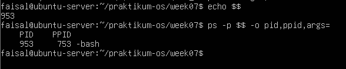

3. Buat workspace praktikum:
```
mkdir -p ~/praktikum-os/week07-bash/{bin,backup,logs,sampel,ruang-nama}
cd ~/praktikum-os/week07-bash
pwd
```
Hasil :
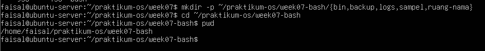

4. Buat beberapa file contoh yang akan dipakai pada praktikum berikutnya:
```
touch sample-app.conf
touch logs/app-01.log logs/app-02.log logs/app-03.log
touch sampel/catatan-a.txt sampel/catatan-b.txt
touch sampel/backup-01.tar sampel/backup02.tar
touch sampel/laporan-harian.log sampel/laporan-mingguan.log sampel/laporan-bulanan.log
touch "ruang-nama/laporan server april.txt"
touch "ruang-nama/backup [mingguan] server.conf"
ls -R
```
Hasil :
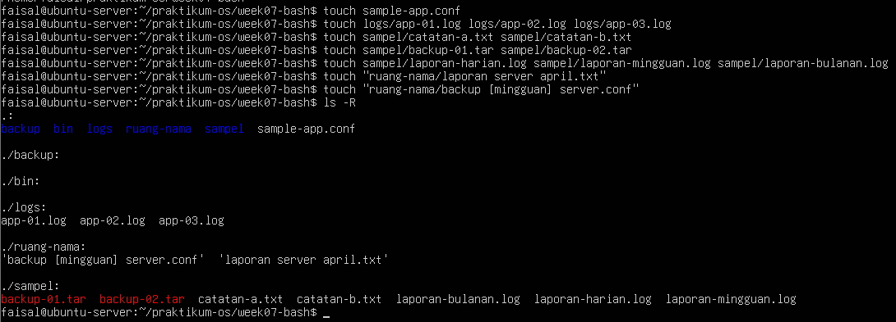

## Praktikum 7.2 — Membuat Ringkasan Sesi Terminal
1. Masuk ke workspace praktikum:
```
cd ~/praktikum-os/week07-bash
```
Hasil :
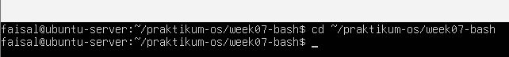

2. Simpan informasi sesi terminal ke file laporan:
```
{
    echo "=== RINGKASAN SESI BASH ==="
    date
    echo "User          : $(whoami)"
    echo "Hostname      : $(hostname)"
    echo "Shell login   : $SHELL"
    echo "Shell aktif   : $0"
    echo "PID shell     : $$"
    echo "Direktori     : $(pwd)"
} | tee session-info.txt
```
Hasil :
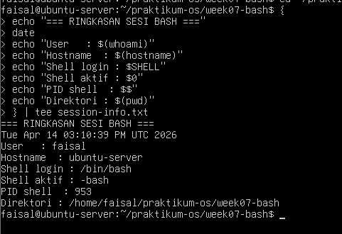

3. Verifikasi isi file laporan:
```
cat session-info.txt
```
Hasil :
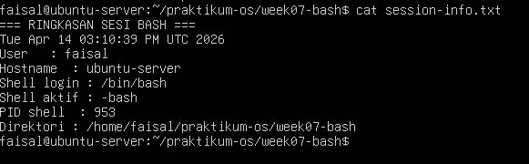

## Praktikum 7.3 — Menambahkan Konfigurasi Aman pada .bashrc
1. Lihat file konfigurasi Bash pada home directory:
```
ls -la ~ | grep -E 'bashrc|bash_profile|profile'
```
Hasil :
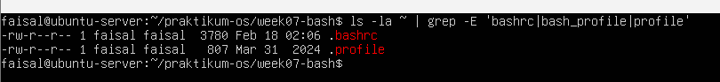

2. Buat backup .bashrc:
```
cp ~/.bashrc ~/.bashrc.bak-praktikum
```
Hasil :
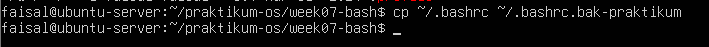

3. Tambahkan blok konfigurasi praktikum:
```
cat <<'EOF' >> ~.bashrc

# --- Praktikum Bash Shell --- 
export PRAKTIKUM_BASH_DIR="$HOME/praktikum-os/wekk07-bash"
export EDITOR=nano
# --- End Praktikum Bash Shell ---

EOF
```
Hasil :
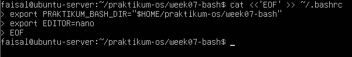

4. Terapkan konfigurasi tanpa logout:
```
source ~/.bashrc
echo "$PRAKTIKUM_BASH_DIR"
echo "$EDITOR"
```
Hasil :
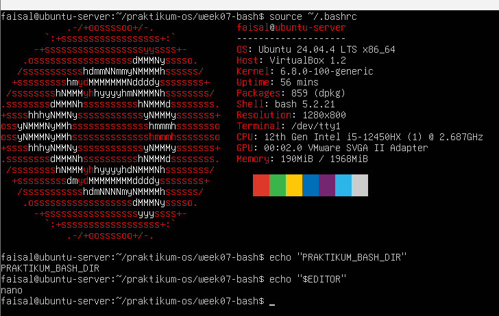


## Praktikum 7.4 — Menyiapkan .bash_profile untuk Shell Login
1.  Backup .bash_profile jika sudah ada:
```
[ -f ~/.bash_profile ] && cp ~/.bash_profile ~/.bash_profile.bak-praktikum
```
Hasil :
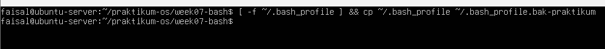


2. Tambahkan konfigurasi login shell:
```
cat <<'EOF' >> ~/.bash_profile

# --- Praktikum Bash Login Shell ---
if [ -f ~/.bashrc ]; then
    . ~/.bashrc
fi

echo "Login Bash pada $(date '+%F %T')" >> "$HOME/praktikum-os/week07-bash/login-audit.log"
# --- End Praktikum Bash Login Shell ---

EOF
```
Hasil :
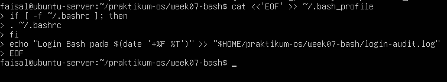


3. Uji dengan membuka login shell baru:
```
bash -l
tail -n 3 ~/praktikum-os/week07-bash/login-audit.log
exit
```
Hasil :
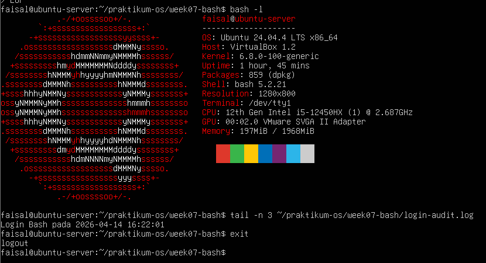


## Praktikum 7.5 — Membedakan Variabel Shell dan Environment Variable
1. Buat variabel lokal:
```
KELAS_OS="Sistem Operasi A"
echo "$KELAS_OS"
```
Hasil :
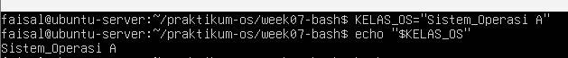


2. Buka subshell dan cek apakah variabel masih ada:
```
bash echo "KELAS_OS"
exit
```
Hasil :
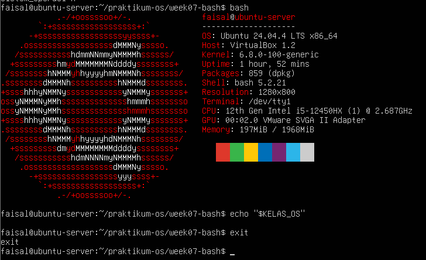


3. Sekarang ubah menjadi environment variabel:
```
export KELAS_OS="Sistem Operasi A"
bash
echo "$KELAS_OS"
exit
```
Hasil :
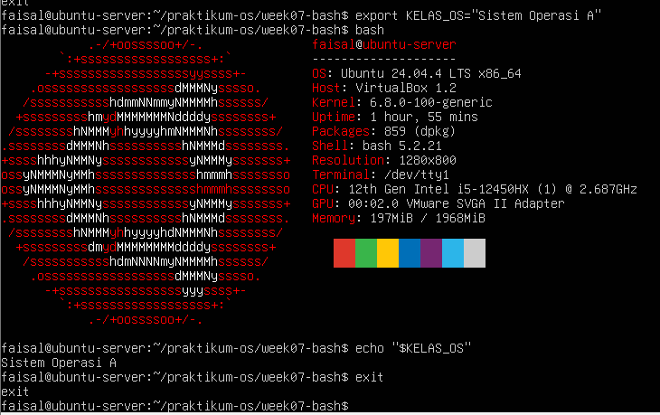


4. Lihat isi PATH dan lokasi beberapa perintah:
```
echo "$PATH"
which bash
type ls
```
Hasil :
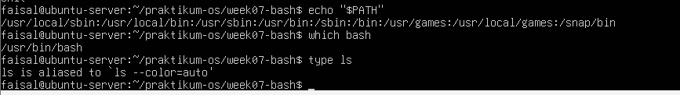


## Praktikum 7.6 — Menambahkan Direktori Script Pribadi ke PATH
1. pastikan direktori bin praktikum tersedia:
```
mkdir -p ~/praktikum-os/week07-bash/bin
```
Hasil :
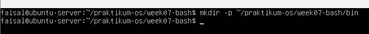


2. Tambahkan direktori tersebut ke PATH melalui .bashrc:
```
cat <<'EOF' >> ~/.bashrc

# --- Praktikum PATH ---
export PATH="$HOME/praktikum-os/week07-bash/bin:$PATH"
# --- End Praktikum PATH ---

EOF

source ~/.bashrc
echo "$PATH"
```
Hasil :
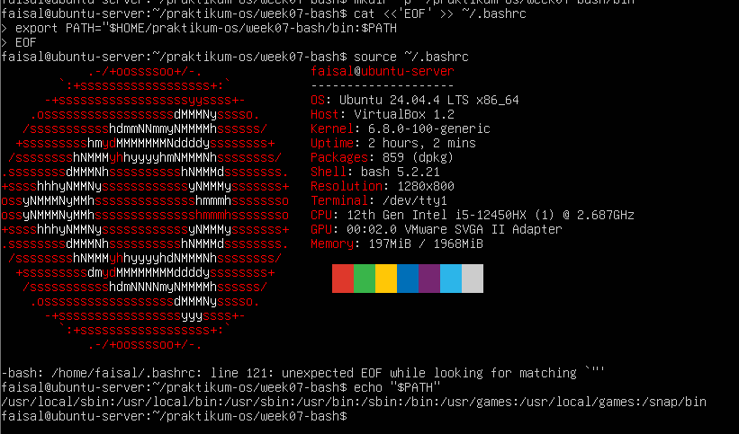


3. Buat script ringkasan sistem:
```
cat <<'EOF' >> ~/praktikum-os/week07-bash/bin/ringkas-sistem
#!/usr/bin/env bash
echo "Hostname  : $(hostname)"
echo "User      : $(whoami)"
echo "Uptime    : $(uptime -p)"
echo "Disk /    :"
df -h /
EOF

chmod +x ~/praktikum-os/week07-bash/bin/ringkas-sistem
```
Hasil :
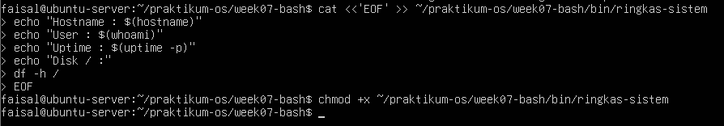


4. Jalankan script dari direktori yang berbeda:
```
cd ~
ringkas-sistem
```
Hasil :
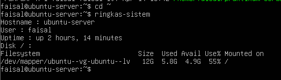


## Praktikum 7.7 — Membuat Alias Produktivitas Dasar
1. Tambahkan alias ke .bashrc:
```
cat <<'EOF' >> ~/.bashrc

# --- Praktikum Alias ---
alias ll='ls -lah --color=auto'
alias hits10='history | tail -n 10'
alias cdbashlab='cd $HOME/praktikum-os/week07-bash'
# --- End Praktikum Alias ---

EOF

source ~/.bashrc
```
Hasil :
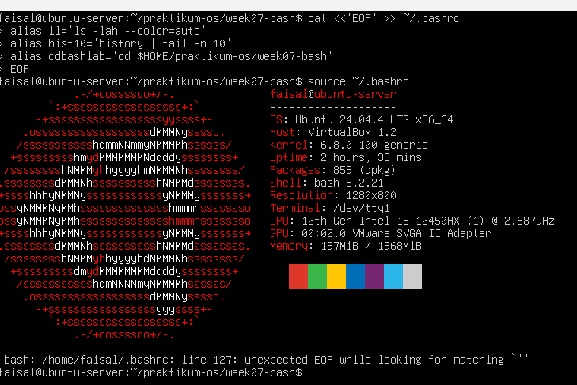


2. Uji alias:
```
ll
hist10
cdbashlab
pwd
type ll
```
Hasil :
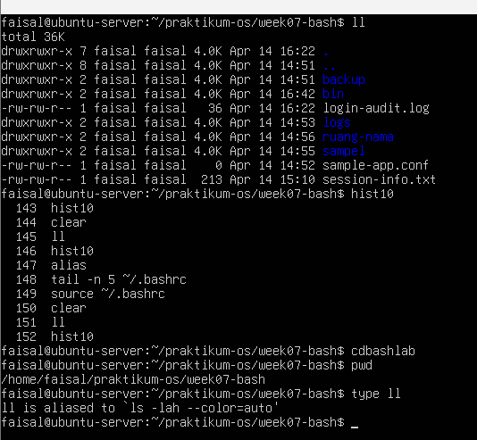


## Praktikum 7.8 — Membuat Fungsi Backup Konfigurasi
1. Siapkan file konfigurasi contoh:
```
echo "PORT=8080" > ~/praktikum-os/week07-bash/sample-app.conf
cat ~/praktikum-os/week07-bash/sample-app.conf
```
Hasil :
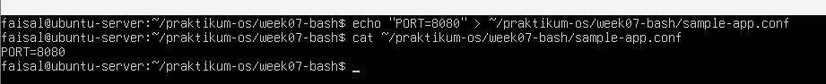


2. Tambahkan fungsi ke .bashrc:
```
cat <<'EOF' >> ~/.bashrc

# --- Praktikum Fungsi Shell ---
backup_conf () {
    if [ $# -ne 1 ]; then 
        echo "Usage: backup_conf <file>"
        return 1
    fi

    local src="$1"
    local dst="$HOME/praktikum-os/week07-bash/backup"

    if [ ! -f "$src" ]; then
        echo "File tidak ditemukan: $src"
        return 2
    fi

    mkdir -p "$dst"
    cp -- "$src" "$dst/$(basename "$src").$(date +%F-H%M%S).bak"
    echo "Backup selesai di $dst"
}
# --- End Praktikum Fungsi Shell ---

EOF

source ~/.bashrc
```
Hasil :
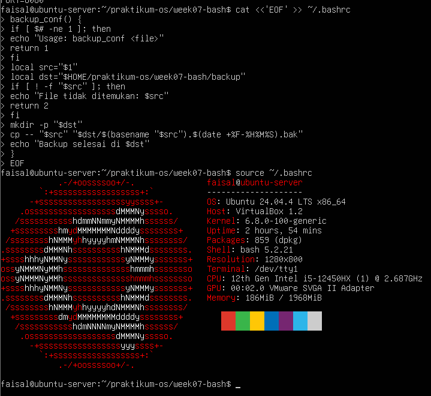


3. Uji fungsi:
```
backup_conf ~/praktikum-os/week07-bash/sample-app.conf
ls -lah ~/praktikum-os/week07-bash/backup
type backup_conf
```
Hasil :
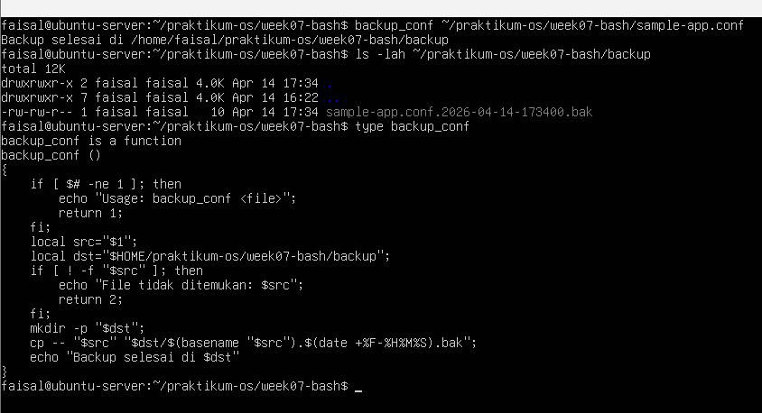


## Praktikum 7.9 — Menggunakan Completion Dasar dan Melihat History
1. Pastikan file contoh tersedia:
```
cd ~/praktikum-os/week07-bash/sampel
touch laporan-harian.log laporan-mingguan.log laporan-bulanan.log
ls
```
Hasil :
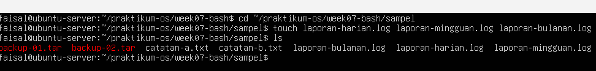


2. Uji completion file:
a. Ketik cat lap lalu tekan Tab dua kali
b. Amati daftar file yang memiliki prefix lap
c. Ketik lebih spesifik, misalnya cat laporan-h lalu tekan Tab
Hasil :
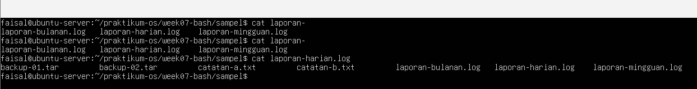


3. Jalankan beberapa perintah sederehana:
```
pwd
ls -lah
date
whoami
history | tail -n 10
```
Hasil :
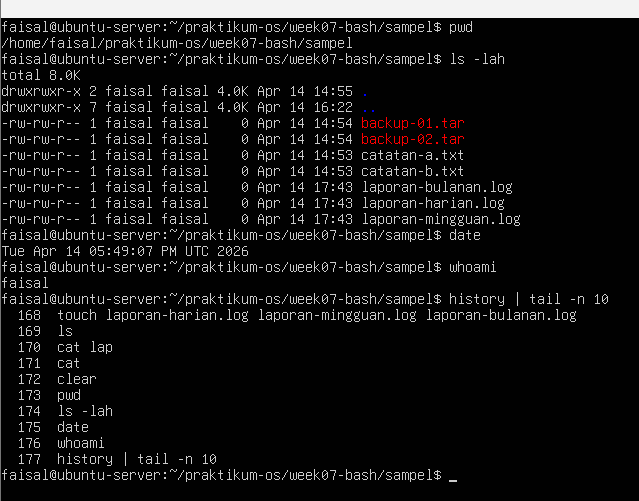


## Praktikum 7.10 — Menelusuri Perintah Diagnostik dengan History
1. Jalankan beberapa perintah diagnostik:
```
df -h
free -h
uptime
ps aux | head
```
Hasil :
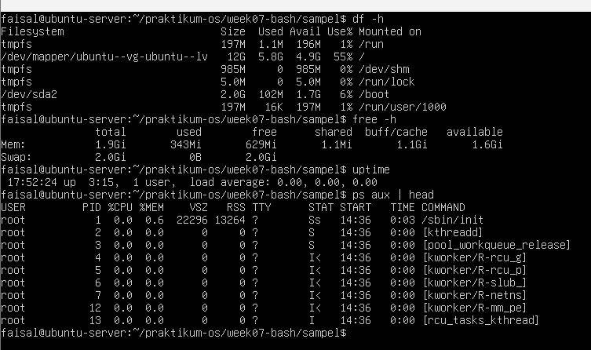


2. Cari ulang perintah diagnostik dari history:
```
history | grep -E 'df -h|free -h|uptime|ps aux'
```
Hasil :
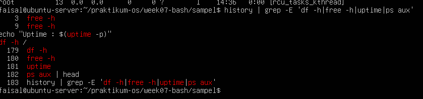


3. Jalankan ulang salah satu perintah berdasarkan nomor history:
```
!<NOMOR_HISTORY_ANDA>
```
Hasil :
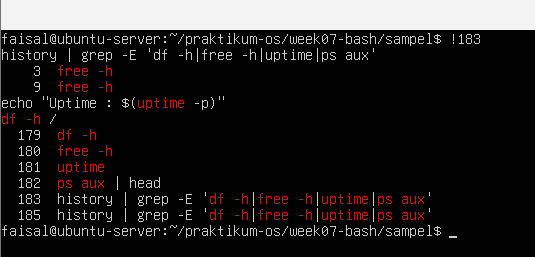


4. Simpan potongan history ke file dokumentasi:
```
history | tail -n 20 > ~/praktikum-os/week07-bash/diag-history.txt
cat ~/praktikum-os/week07-bash/diag-history.txt
```
Hasil :
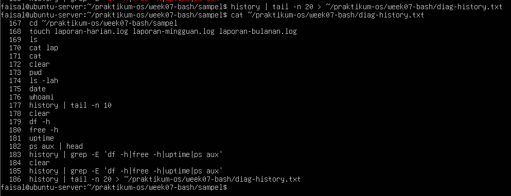


## Praktikum 7.11 — Mencoba Wildcard Dasar
1. Masuk ke direktori sampel:
```
cd ~/praktikum-os/week07-bash/sampel
ls
```
Hasil :
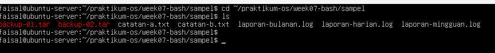


2. Coba beberapa pola wildcard:
```
ls *.log
ls catatan-?.txt
ls backup-0[12].tar
```
Hasil :
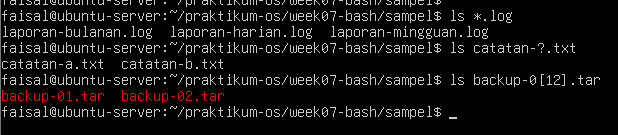


3. Coba beberapa ekspansi lain:
```
echo log-{pagi, siang, malam}.txt
echo ~
echo ~/praktikum-os/week07-bash
```
Hasil :
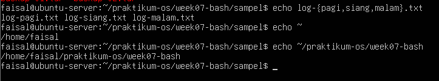


## Praktikum 7.12 — Mengarsipkan Banyak Log Sekaligus
1. Siapkan file log tambahan:
```
cd ~/praktikum-os/week07-bash/logs
touch access-01/log access-02.log access-03.log
ls
```
Hasil :
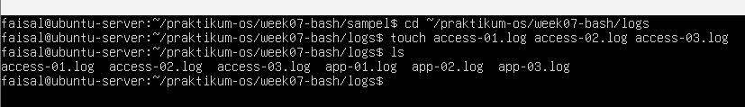


2. Preview file yang akan diproses:
```
echo *.log
echo access-0?.log
```
Hasil :
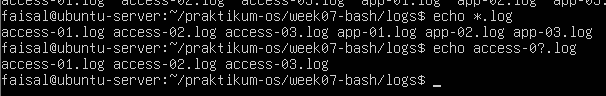


3. Pindahkan semua file log ke folder arsip:
```
mkdir -p arsip-log
mv *.log arsip-log/
ls arsip-log
```
Hasil :
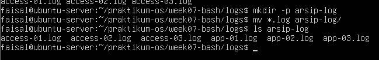


4. Kompres folder arsip:
```
tar -czf arsip-log-$(date +%F).tar.gz arsip-log
ls -lah
```
Hasil :
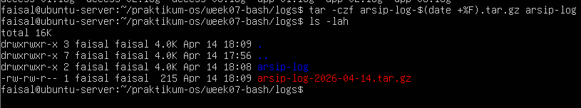


## Praktikum 7.13 — Membedakan Single Quote, Double Quote, dan Escape
1. Uji sinngle quote dna double quote:
```
echo '$USER bekerja di $HOME'
echo "$USER bekerja di $HOME"
```
Hasil :
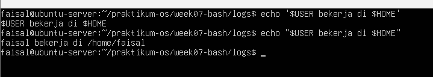


2. Uji escape karakter spasi:
```
cd ~/praktikum-os/week07-bash/ruang-nama
ls laporan\ server\ april.txt
```
Hasil :
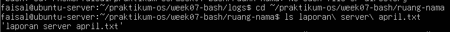


3. Ujia akses file yang sama dengan double quote:
```
cat "laporan server april.txt"
```
Hasil :
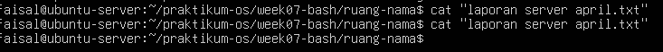


## Praktikum 7.14 — Menangani File dengan Nama Sulit Secara Aman
1. Pastikan file target tersedia:
```
cd ~/praktikum-os/week07-bash/ruang-nama
ls -lah
```
Hasil :
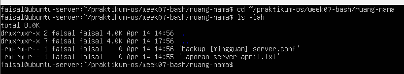


2. Salin file dengan nama kompleks ke folder backup:
```
cp -- "backup [mingguan] server.conf" \
    "$HOME/praktikum-os/week07-bash/backup/backup-mingguan-server.conf"
```
Hasil :
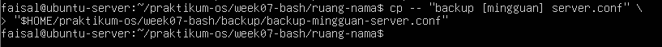


3. Gunakan variabel untuk memproses path dengan aman:
```
file_asli="$HOME/praktikum-os/week07-bash/ruang-nama/backup [mingguan] server.conf"
file_salinan=$HOME/praktikum-os/week07-bash/backup/backup-mingguan-server-v2.conf

cp -- "$file_asli" "$file_salinan"
ls -lah "$HOME/praktikum-os/week07-bash/backup"
```
Hasil :
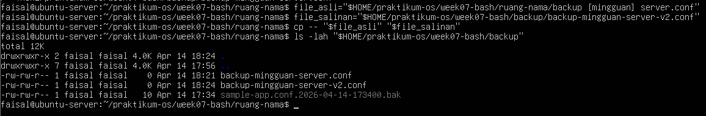


4. Tampilkan daftar file hasil backup:
```
for file in "$HOME"/praktikum-os/week07-bash/backup/*;
    do
   printf 'Hasil backup: %s\n' "$file"
done
```
Hasil :
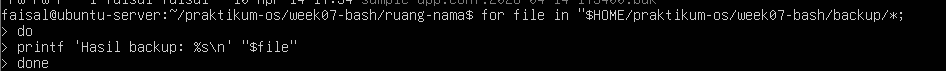


# TUGAS PRAKTIKUM
## Tugas Praktikum 1 — Toolkit Bash Administrator Pribadi
Konteks riil: seorang administrator sering mengulang perintah yang sama setiap hari. Agar pekerjaan lebih efisien dan konsisten, ia perlu memiliki toolkit Bash pribadi yang otomatis aktif setiap login.
Instruksi tugas:
1. Tambahkan konfigurasi pada .bashrc untuk:

• menambahkan direktori bin pribadi ke PATH,

• membuat minimal 2 alias yang membantu kerja harian,

• membuat minimal 1 fungsi shell yang berguna untuk administrasi.

2. Pastikan konfigurasi tersebut aktif kembali saat membuka shell login.

3. Buat satu script sederhana di direktori bin pribadi, misalnya script untuk menampilkan ringkasan sistem.

4. Uji dari direktori yang berbeda untuk memastikan script dapat dipanggil tanpa menuliskan path lengkap.

5. Simpan bukti pengujian ke file toolkit-bash-report.txt.
Minimal luaran:

• isi blok konfigurasi yang ditambahkan ke .bashrc,

• output echo $PATH,

• output type untuk alias, fungsi, dan script,

• file laporan toolkit-bash-report.txt.

Hasil :
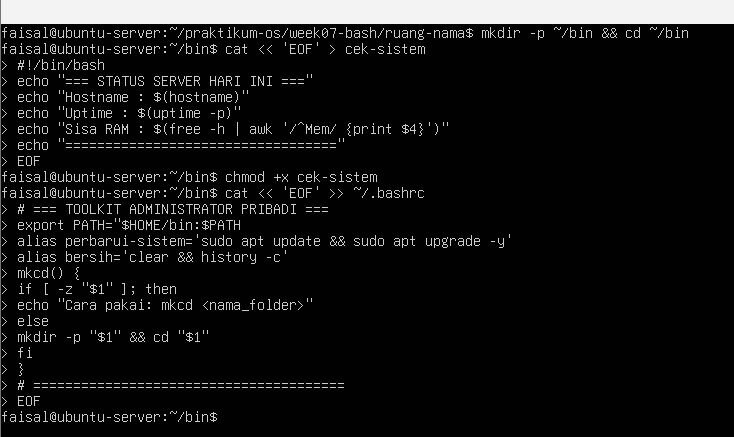
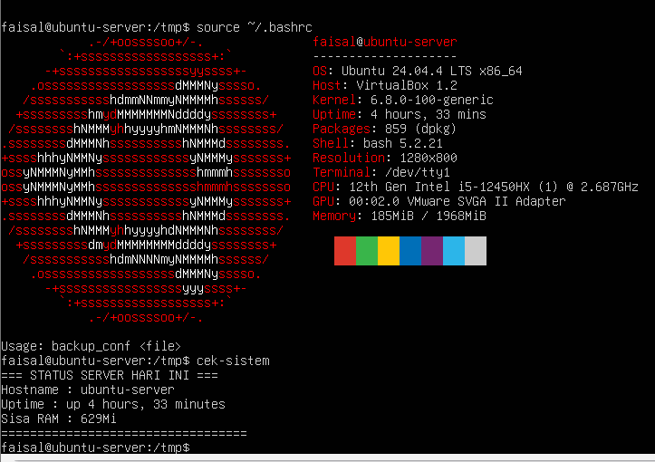


## Tugas Praktikum 2 — Audit File Konfigurasi dan Logging Aman
Konteks riil: saat troubleshooting, administrator sering perlu menginventarisasi
file konfigurasi dan memisahkan output normal dari pesan error.
Instruksi tugas:
1. Buat file laporan bernama audit-konfigurasi-$(date +%F).txt.
2. Cari file *.conf di dalam /etc dan simpan hasilnya ke file laporan.
3. Catat jumlah total file konfigurasi yang ditemukan.
4. Jika ada pesan error, simpan ke file terpisah, misalnya audit-error.log.
5. Tampilkan isi laporan ke terminal dan sekaligus simpan menggunakan tee.
6. Tambahkan ringkasan singkat 3–5 baris yang menjelaskan mengapa pemisahan
stdout dan stderr penting dalam audit sistem.

Syarat konsep yang harus muncul:

• redirection >, 2>, atau &>,
• pipeline,
• tee,
• penggunaan variabel atau command substitution.
Minimal luaran:
• file laporan audit,
• file log error,
• perintah yang digunakan,
• analisis singkat hasil audit.

Hasil :


## Tugas Praktikum 3 — Mini Health Check Harian Server
Konteks riil: administrator perlu membuat pemeriksaan cepat (health check) untuk
mengetahui kondisi dasar server sebelum dan sesudah maintenance.
Instruksi tugas:
1. Buat script Bash bernama daily-healthcheck pada direktori bin pribadi.
2. Script minimal harus menampilkan:
• tanggal dan waktu,
• hostname,
• user aktif,
• shell aktif,
• uptime,
• penggunaan memori,
• penggunaan filesystem root,
• 10 baris terakhir history command yang relevan dengan pengecekan.
3. Simpan hasil ke file log harian, misalnya healthcheck-$(date +%F).log.
4. Tampilkan hasil ke terminal dan ke file secara bersamaan.
5. Jika Anda menggunakan pipeline dengan tee, cek juga status exit command utama

Syarat konsep yang harus muncul:
• environment variable,
• PATH,
• alias atau fungsi pendukung,
• history,
• tee,
• penanganan error dasar.
Minimal luaran:
• file script yang executable,
• contoh isi file log hasil eksekusi,
• penjelasan singkat fungsi tiap bagian script.

Hasil :


## Tugas Praktikum 4 — Penanganan File dengan Nama Kompleks dan Arsip Aman
Konteks riil: file hasil backup, ekspor, atau laporan sering memiliki nama yang
mengandung spasi atau karakter khusus. Administrator harus tetap dapat memproses
file-file tersebut tanpa salah target.
Instruksi tugas:
1. Buat minimal 4 file contoh dengan nama yang bervariasi, termasuk:
• nama file yang mengandung spasi,
• nama file yang mengandung tanda kurung siku atau karakter khusus,
• file dengan pola nama serupa untuk diuji dengan wildcard.
2. Tunjukkan perbedaan hasil jika file diakses tanpa quoting dan dengan quoting
yang benar.
3. Lakukan preview wildcard dengan echo sebelum dipakai untuk operasi nyata.
4. Salin file-file tersebut ke direktori backup dengan nama yang aman.
5. Buat arsip tar.gz dari hasil backup.
6. Simpan riwayat perintah yang Anda gunakan ke file riwayat-arsip.txt.

Syarat konsep yang harus muncul:
• single quote, double quote, dan escaping,
• wildcard,
• variabel path,
• history,
• operasi file lanjutan yang aman.
Minimal luaran:
• daftar file awal,
• daftar file hasil backup,
• file arsip tar.gz,
• file riwayat-arsip.txt,
• refleksi singkat tentang pentingnya quoting di Bash.

Hasil :

